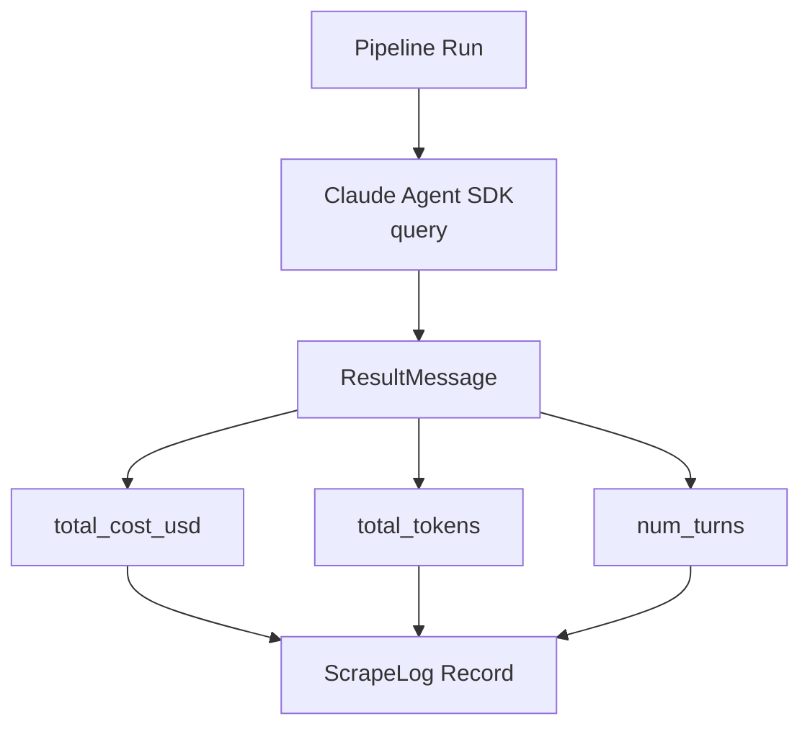
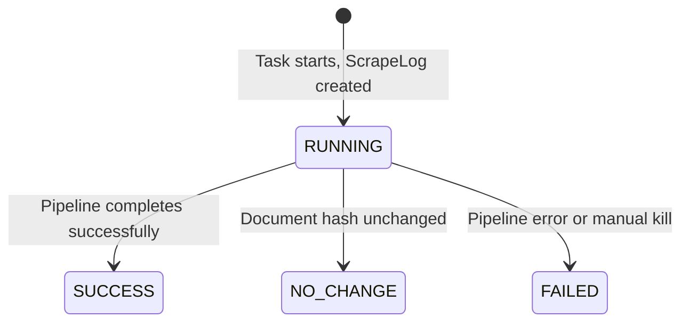
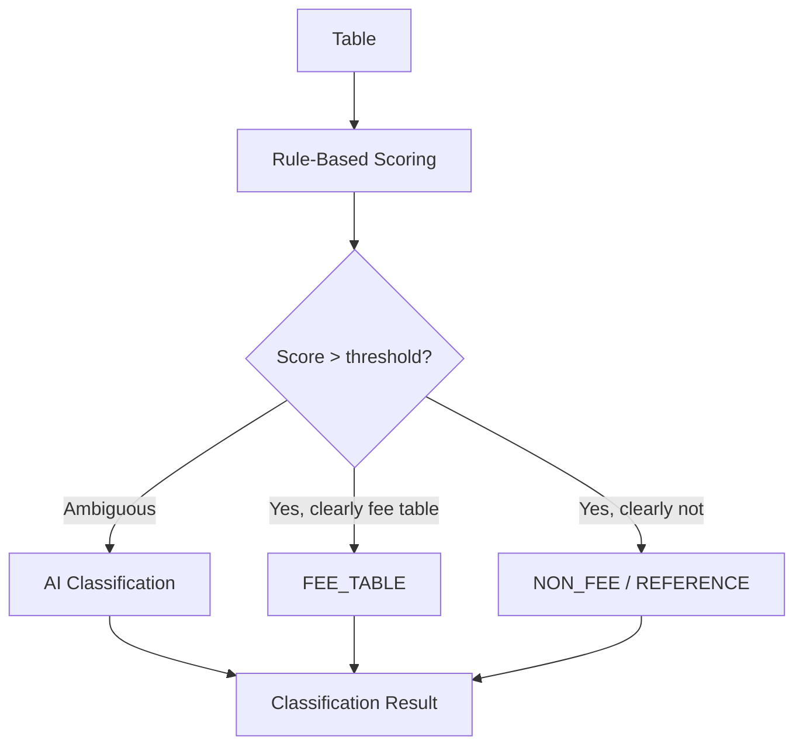

# AI Agent System

[← Home](Home.md) | [Pipeline Deep Dive](Pipeline-Deep-Dive.md)

## Overview

ExNot uses the **Claude Agent SDK** (`claude-agent-sdk`) for intelligent fee schedule extraction. The SDK runs an orchestrator agent that coordinates MCP tools and subagents via a Claude Code CLI subprocess. Per-exchange prompts ensure maximum extraction accuracy.

## Architecture

```mermaid
graph TB
    subgraph "Orchestrator (agents/pipeline.py)"
        Orch[Orchestrator Agent<br/>System prompt + execution rules]
    end

    subgraph "MCP Tools (agents/tools/)"
        T1[load_exchange]
        T2[load_exchange_prompt]
        T3[scrape_document]
        T4[check_document_changed]
        T5[parse_document]
        T6[try_profile_extract]
        T7[save_profile]
        T8[normalize_fees]
        T9[detect_changes]
        T10[save_snapshot]
        T11[save_scraped_document]
        T12[send_notifications]
        T13[search_fee_urls]
    end

    subgraph "Subagents (agents/subagents/)"
        SE[Extractor<br/>Per-exchange prompts]
        FV[Validator<br/>Completeness checks]
        DA[Discovery<br/>URL evaluation]
    end

    Orch -->|MCP tool calls| T1
    Orch -->|MCP tool calls| T3
    Orch -->|MCP tool calls| T5
    Orch -->|MCP tool calls| T8
    Orch -->|MCP tool calls| T9
    Orch -->|Task delegation| SE
    Orch -->|Task delegation| FV
    Orch -->|Task delegation| DA

    style Orch fill:#4CAF50,color:white
    style SE fill:#E91E63,color:white
    style FV fill:#FF9800,color:white
    style DA fill:#4CAF50,color:white
```



## Orchestrator Agent

The orchestrator (`agents/pipeline.py`) is the entry point. It receives a system prompt with execution rules and coordinates the full pipeline via MCP tool calls and subagent delegation.

**Key configuration** (`ClaudeAgentOptions`):
```python
options = ClaudeAgentOptions(
    system_prompt=ORCHESTRATOR_SYSTEM_PROMPT,
    allowed_tools=["mcp__exnot__*", "Task"],
    mcp_servers={"exnot": tools_server},
    agents={"extractor": extractor, "validator": validator, "discovery": discovery},
    permission_mode="default",
    can_use_tool=_auto_approve_tool,
    model=settings.claude_orchestrator_model,
)
```

**Headless execution**: Uses `can_use_tool` callback that auto-approves all tool calls (required for Docker/root where `bypassPermissions` is blocked).

**Streaming prompt**: The `can_use_tool` callback requires the prompt to be an `AsyncIterable[dict]`, not a plain string.

**CLAUDECODE env var**: Must `os.environ.pop("CLAUDECODE", None)` before SDK calls to prevent nested session errors.

## MCP Tools

All pipeline operations are exposed as MCP tools via `create_sdk_mcp_server()` in `agents/tools/server.py`:

| Tool | File | Purpose |
|------|------|---------|
| `load_exchange` | `exchange.py` | Load exchange config (name, URLs, metadata) |
| `load_exchange_prompt` | `exchange.py` | Load exchange-specific extraction prompt |
| `search_fee_urls` | `discovery.py` | Search web for fee schedule URLs (SerpAPI) |
| `scrape_document` | `scraping.py` | Download document from URL (HTTP or browser) |
| `check_document_changed` | `scraping.py` | Hash-based change detection vs latest snapshot |
| `parse_document` | `parsing.py` | Parse PDF/HTML/CSV into structured text + tables |
| `try_profile_extract` | `profiles.py` | Zero-cost extraction using saved profile |
| `save_profile` | `profiles.py` | Save extraction profile for future runs |
| `normalize_fees` | `normalization.py` | Map extracted fees to canonical schema |
| `detect_changes` | `diffing.py` | Compare fees against previous snapshot |
| `save_snapshot` | `persistence.py` | Save snapshot + normalized fees to DB |
| `save_scraped_document` | `persistence.py` | Persist raw document to MinIO |
| `send_notifications` | `notifications.py` | Email subscribers about fee changes |

Tools are decorated with `@tool()` from `claude_agent_sdk` and return MCP-format responses:
```python
@tool("scrape_document", "Download a document from a URL...", {"url": str, "method": str, "exchange_code": str})
async def scrape_document(args):
    # ... returns {"content": [{"type": "text", "text": json.dumps({...})}]}
```

## Subagents

Subagents are defined as `AgentDefinition` objects and invoked by the orchestrator via the `Task` tool.

### Extractor (`agents/subagents/extractor.py`)

The core extraction agent. Receives document text/sections and returns structured JSON fee data.

**Prompt composition**:
```
BASE_EXTRACTION_PROMPT (output format, field enums, critical rules)
+ Exchange-specific prompt (from agents/prompts/ registry)
```

**Output**: JSON array of fee objects with fields: `participant_type`, `security_class`, `order_type`, `fee_type`, `amount_cents`, `is_rebate`, `origin_code`, `confidence`, etc.

**Participant type mapping**:
- Customer / Priority Customer / Public Customer → `CUSTOMER`
- Professional / Professional Customer → `PROFESSIONAL`
- Firm / Firm Proprietary → `FIRM`
- Broker-Dealer / Non-Member BD / JBO → `BROKER_DEALER`
- Market Maker / LMM / RMM / Specialist → `MARKET_MAKER`
- Away Market Maker / Non-Exchange MM → `AWAY_MARKET_MAKER`

### Validator (`agents/subagents/validator.py`)

Validates extraction completeness and correctness. Returns JSON with `is_valid`, `confidence` (0.0–1.0), `issues`, and `suggested_corrections`.

**Checks performed**:
1. Participant coverage (CUSTOMER, PROFESSIONAL, MARKET_MAKER, FIRM present)
2. Fee type coverage (MAKER and TAKER fees present)
3. Amount reasonableness (within -$1.50 to $1.50 per contract range)
4. Sign/rebate consistency (negative amounts → is_rebate=true)
5. Tier completeness (sequential tier_level values)
6. Duplicate detection

### Discovery (`agents/subagents/discovery.py`)

Evaluates search results to identify the best fee schedule URL. Returns JSON with `primary_url`, `alternate_urls`, `confidence`, and `reasoning`.

**Evaluation criteria**: Official exchange domains preferred, direct PDF/HTML links over landing pages, current/undated URLs over archived versions.

## Execution Rules

The orchestrator follows these rules (defined in the system prompt):

1. **Always load exchange config first** via `load_exchange`
2. **Use discovery subagent only if no configured URLs** — call `search_fee_urls` then delegate to discovery subagent
3. **Check if document changed** via `check_document_changed` — skip if unchanged (unless force mode)
4. **Try profile-based extraction first** via `try_profile_extract` — zero AI cost if profile matches
5. **For AI extraction**, load exchange prompt then delegate to extractor subagent
6. **Process section groups sequentially**, accumulate all extracted fees
7. **Validate with validator subagent** — if confidence < 0.8, retry extraction once with corrections
8. **Always save results** via `save_snapshot` and `save_profile`
9. **Send notifications only if changes detected** — `detect_changes` then `send_notifications`

## Cost Tracking

Pipeline costs are tracked via `ResultMessage` from the Claude Agent SDK:



**Budget guardrails** (enforced in pipeline configuration):
- Per-exchange: `$2.00` (`AI_BUDGET_PER_EXCHANGE_USD`)
- Daily total: `$15.00` (`AI_BUDGET_DAILY_USD`)

Cost data is stored in the `ScrapeLog` record for each pipeline run.

## Audit Trail

Pipeline execution is tracked via `ScrapeLog` records with status lifecycle:



**ScrapeLog fields**: `status`, `celery_task_id`, `total_cost_usd`, `total_tokens`, `num_turns`, `error_message`, `duration_seconds`.

**Real-time events** are streamed via Redis pub/sub:
- Channel: `exnot:pipeline:events:{exchange_code}`
- Persistence: Redis lists at `exnot:pipeline:log:{scrape_log_id}` (24h TTL)
- Events broadcast to dashboard via SSE for live monitoring

## Per-Exchange Prompts

Located in `agents/prompts/`, one file per exchange plus `base.py`.

**`BASE_PROMPT`** defines:
- Output schema (all field names, allowed enum values)
- Rebate sign conventions
- General extraction rules

**Exchange prompts** add:
- Terminology mappings (e.g., "Priority Customer" → origin_code "C")
- Table structure descriptions
- Fee code prefix semantics
- Tier condition formulas
- Special cases (free trades, surcharges, symbol-specific fees)

```python
# Example: getting the full prompt for CBOE BZX
from exnot.agents.prompts.registry import get_extraction_prompt
prompt = get_extraction_prompt("CBOE_BZX")
# Returns: BASE_PROMPT + CBOE_BZX-specific prompt
```

For exchanges without a dedicated prompt, only `BASE_PROMPT` is used.

**18 exchange prompts** are registered in `agents/prompts/registry.py`:
CBOE (BZX, C1, C2, EDGX) · NASDAQ (BX, GEMX, ISE, MRX, NOM, PHLX) · MIAX (Emerald, Options, Pearl, Sapphire) · NYSE (American, Arca) · BOX Options · MEMX Options

## Hybrid Table Classification

Tables are classified using a rules-first approach to minimize AI costs:



**Rule-based signals**: Header keywords ("fee", "rebate", "per contract"), numeric density, column patterns, section context.

## Related Pages

- [Pipeline Deep Dive](Pipeline-Deep-Dive.md) — how agents fit in the pipeline
- [Extraction Profiles](Extraction-Profiles.md) — zero-cost alternative to AI
- [Configuration Guide](Configuration-Guide.md) — model and budget env vars
- [Dashboard & Monitoring](Dashboard-and-Monitoring.md) — real-time agent monitoring
