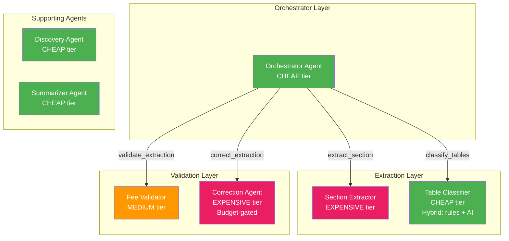
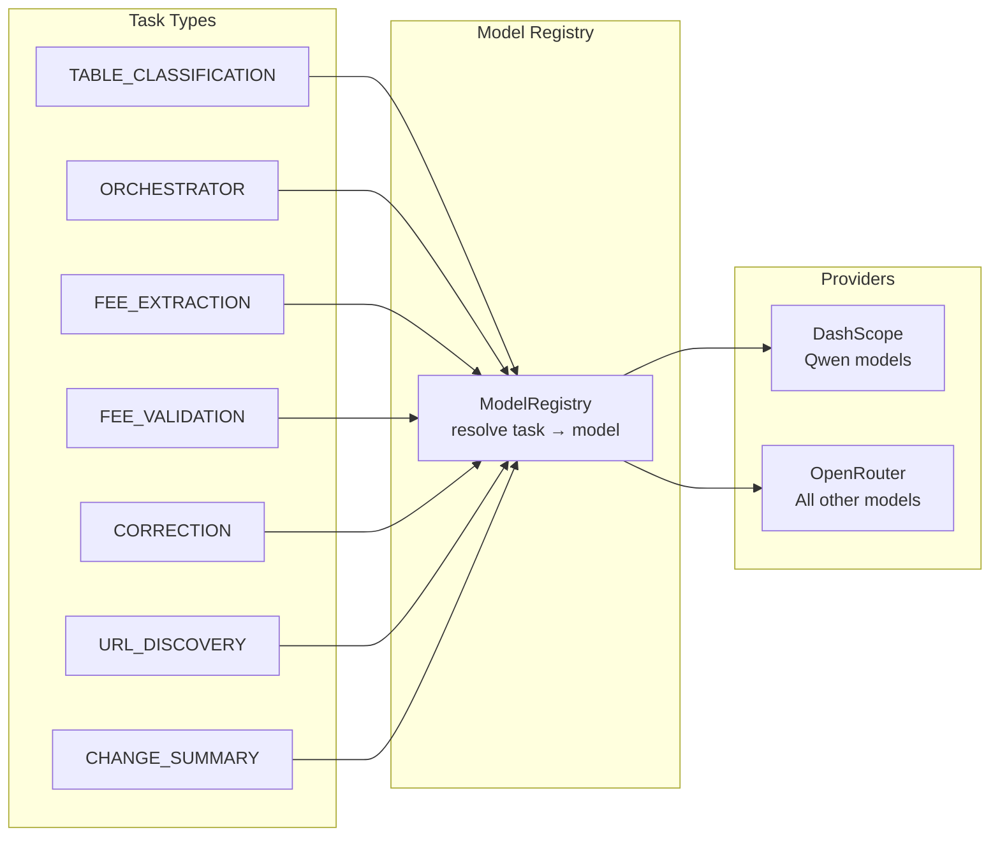
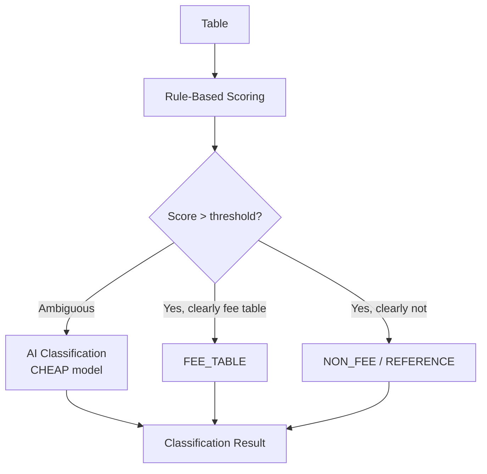
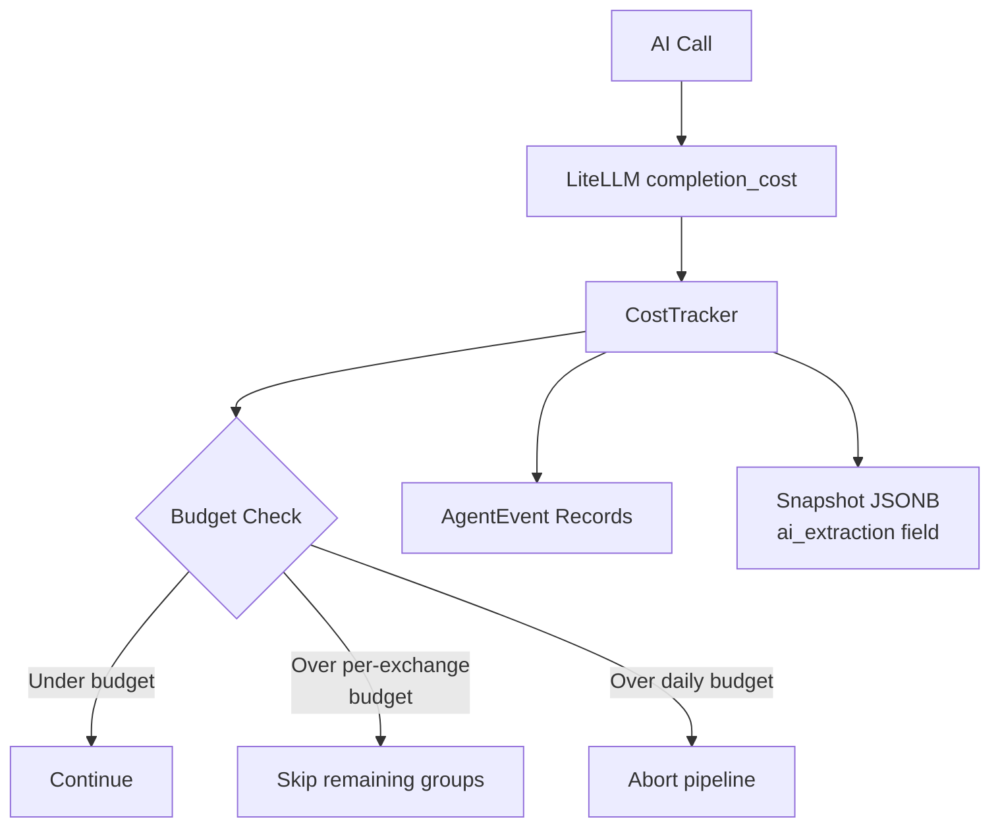

# AI Agent System

[← Home](Home.md) | [Pipeline Deep Dive](Pipeline-Deep-Dive.md)

## Overview

ExNot uses PydanticAI agents backed by LiteLLM for intelligent fee schedule extraction. The system routes different tasks to different models based on cost/quality trade-offs, tracks costs per pipeline run, and uses per-exchange prompts for maximum extraction accuracy.

## Agent Graph



> **Note**: In the current implementation, `AIExtractor` bypasses the orchestrator and directly iterates over section groups, calling the section extractor and validator agents. The orchestrator is defined as a fallback/alternative path.

## Model Routing

Each agent task maps to a configurable model, enabling independent cost/quality tuning:



**Default model assignments**:

| Task | Env Var | Default Model | Cost Tier |
|------|---------|---------------|-----------|
| Table Classification | `AI_MODEL_TABLE_CLASSIFICATION` | `qwen/qwen3.5-flash-02-23` | CHEAP |
| Orchestrator | `AI_MODEL_ORCHESTRATOR` | `qwen/qwen3.5-flash-02-23` | CHEAP |
| Fee Extraction | `AI_MODEL_FEE_EXTRACTION` | `deepseek/deepseek-v3.2-20251201` | EXPENSIVE |
| Fee Validation | `AI_MODEL_FEE_VALIDATION` | `mistralai/mistral-small-3.1-24b-instruct` | MEDIUM |
| Correction | `AI_MODEL_CORRECTION` | `deepseek/deepseek-v3.2-20251201` | EXPENSIVE |
| URL Discovery | `AI_MODEL_URL_DISCOVERY` | `qwen/qwen3.5-flash-02-23` | CHEAP |
| Change Summary | `AI_MODEL_CHANGE_SUMMARY` | `qwen/qwen3.5-flash-02-23` | CHEAP |

**Provider routing logic**:
- If `DASHSCOPE_API_KEY` is set and the model starts with `qwen/`, route directly to DashScope (bypasses OpenRouter markup)
- All other models route through OpenRouter via `OPENROUTER_API_KEY`
- DashScope calls include `extra_body={"enable_thinking": False}` for tool_choice compatibility

## Agent Details

### Section Extractor (`ai/agents/section_extractor.py`)

The core extraction agent. Receives a document section with tables and returns structured `SectionExtractionResult` containing a list of `ExtractedFee` objects.

**Output validator** auto-corrects sign/rebate consistency:
```
If fee_value < 0 → set is_rebate = True
If is_rebate = True and fee_value > 0 → negate fee_value
```

**Prompt composition**:
```
BASE_PROMPT (V3 schema definition, all field enums)
+ Exchange-specific prompt (terminology, table layout, special rules)
+ Section text + formatted tables
+ Context sections (tier definitions, footnotes)
```

### Fee Validator (`ai/agents/fee_validator.py`)

Validates extraction completeness. Returns `ValidationResult` with confidence score (0.0–1.0) and issue list.

**Checks performed**:
- CUSTOMER/Priority Customer fees present
- Both MAKER and TAKER fees present
- Amounts within sanity bounds (< $3/contract)
- Tier group completeness
- Coverage across expected participant types

**Output**: `ValidationResult { confidence: float, issues: list[{description, severity}] }`

### Table Classifier (`ai/agents/table_classifier.py`)

Hybrid classification — rules first, AI only for ambiguous cases:



**Rule-based signals**: Header keywords ("fee", "rebate", "per contract"), numeric density, column patterns, section context.

### Correction Agent (`ai/agents/correction.py`)

Targeted correction for validation issues. **Budget-gated** — only runs if `cost_tracker.budget_remaining > 0`.

Receives the current fees + specific issues from the validator, returns `CorrectionResult` with corrected fees and indices of removed entries.

### Discovery Agent (`ai/agents/discovery.py`)

Evaluates candidate URLs found via SerpAPI to identify the best fee schedule URL for an exchange.

Returns `UrlEvaluationResult { primary_url, alternate_urls, confidence, reasoning }`.

### Summarizer Agent (`ai/agents/summarizer.py`)

Generates human-readable change summaries from `FeeChange` records for email notifications.

## Cost Tracking



**`CostTracker`** (`ai/cost.py`):
- Accumulates per-call costs using LiteLLM's `completion_cost()` function
- Tracks: `total_cost_usd`, individual `calls` list, `budget_usd`
- Properties: `budget_remaining`, `is_over_budget`
- The `summary()` dict is stored in `snapshot.ai_extraction` JSONB for audit

**Budget defaults**:
- Per-exchange: `$2.00` (`AI_BUDGET_PER_EXCHANGE_USD`)
- Daily total: `$15.00` (`AI_BUDGET_DAILY_USD`)

## Audit Trail

Every AI pipeline run is fully audited via two tables:

### AgentRun
One record per pipeline execution. Fields: exchange_code, status, model used, total tokens, total cost, start/end timestamps.

### AgentEvent
Ordered sequence of events within a run:

| Event Type | Description |
|-----------|-------------|
| `PIPELINE_START` | Pipeline initiated |
| `PIPELINE_STEP` | Major step (e.g., "extracting group 2/5") |
| `AI_CALL_START` | LLM call initiated (prompt text stored) |
| `AI_CALL_COMPLETE` | LLM call finished (response, tokens, cost, latency) |
| `AI_CALL_RETRY` | PydanticAI ModelRetry triggered |
| `BUDGET_WARNING` | Approaching or exceeded budget |
| `PIPELINE_COMPLETE` | Pipeline finished |
| `PIPELINE_ERROR` | Pipeline failed with error |

Events are:
1. Saved to PostgreSQL for historical queries
2. Published to Redis pub/sub for real-time SSE streaming to the dashboard monitor

## Per-Exchange Prompts

Located in `ai/prompts/`, one file per exchange plus `base.py`.

**`BASE_PROMPT`** defines:
- V3 output schema (all field names, allowed enum values)
- Rebate sign conventions
- General extraction rules

**Exchange prompts** add:
- Terminology mappings (e.g., "Priority Customer" → origin_code "C")
- Table structure descriptions
- Fee code prefix semantics
- Tier condition formulas
- Special cases (free trades, surcharges, symbol-specific fees)

```python
# Example: getting the full prompt for CBOE BZX
from exnot.ai.prompts.registry import get_extraction_prompt
prompt = get_extraction_prompt("CBOE_BZX")
# Returns: BASE_PROMPT + CBOE_BZX-specific prompt
```

For exchanges without a dedicated prompt, only `BASE_PROMPT` is used.

## Shared Dependencies

Three dependency dataclasses injected into agents via `RunContext[Deps]`:

| Deps Class | Used By | Key Fields |
|-----------|---------|------------|
| `ExtractionDeps` | Extractor, Validator, Correction, Classifier | `model_registry`, `cost_tracker`, `exchange_code`, `exchange_prompt`, `document`, `sections`, `extracted_fees` (accumulator) |
| `DiscoveryDeps` | Discovery Agent | `model_registry`, `cost_tracker`, `exchange_code`, `exchange_name`, `operator` |
| `SummaryDeps` | Summarizer Agent | `model_registry`, `cost_tracker`, `exchange_code` |

## Related Pages

- [Pipeline Deep Dive](Pipeline-Deep-Dive.md) — how agents fit in the pipeline
- [Extraction Profiles](Extraction-Profiles.md) — zero-cost alternative to AI
- [Configuration Guide](Configuration-Guide.md) — model and budget env vars
- [Dashboard & Monitoring](Dashboard-and-Monitoring.md) — real-time agent monitoring
