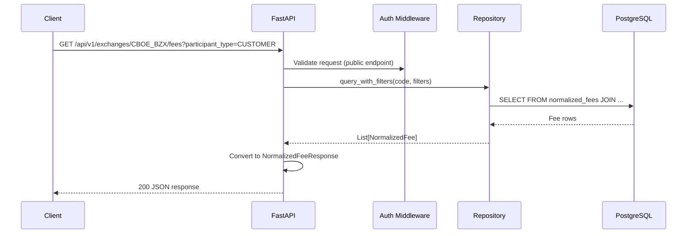

# API Reference

[← Home](Home.md) | [Architecture Overview](Architecture-Overview.md)

## Overview

ExNot exposes a REST API at `/api/v1/` built with FastAPI. Interactive docs are available at `/api/docs` (Swagger UI) and `/api/redoc` (ReDoc).

## Authentication

### Login

```http
POST /api/v1/auth/login
Content-Type: application/x-www-form-urlencoded

username=admin@example.com&password=secret
```

**Response**:
```json
{
  "access_token": "eyJ...",
  "token_type": "bearer"
}
```

### Using the Token

```http
GET /api/v1/admin/...
Authorization: Bearer eyJ...
```

- Tokens are JWT signed with `SECRET_KEY`, valid for 24 hours
- Admin user is auto-created on startup from `ADMIN_EMAIL` / `ADMIN_PASSWORD` env vars
- Dashboard stores the token in an HTTP-only cookie (`access_token`)

## Endpoints

### Exchanges

#### List All Exchanges

```http
GET /api/v1/exchanges
```

Returns all registered exchanges with metadata, last scrape time, and latest snapshot info.

#### Get Exchange Details

```http
GET /api/v1/exchanges/{code}
```

Returns full exchange details including current fee schedule URL, format, and parser hints.

### Fees

#### Get Exchange Fees

```http
GET /api/v1/exchanges/{code}/fees
```

**Query Parameters**:

| Parameter | Type | Description |
|-----------|------|-------------|
| `participant_type` | string | Filter by participant (e.g., `CUSTOMER`) |
| `security_class` | string | Filter by security class (e.g., `PENNY`) |
| `order_type` | string | Filter by order type (e.g., `SIMPLE`) |
| `fee_type` | string | Filter by fee type (e.g., `MAKER`) |
| `version` | int | Specific snapshot version (default: latest) |
| `origin_code` | string | V3 filter: origin code |
| `liquidity_role` | string | V3 filter: liquidity role |
| `product_type` | string | V3 filter: product type |

**Response**:
```json
{
  "exchange_code": "CBOE_BZX",
  "version": 3,
  "scraped_at": "2026-03-04T10:00:00Z",
  "fees": [
    {
      "participant_type": "CUSTOMER",
      "security_class": "PENNY",
      "order_type": "SIMPLE",
      "fee_type": "MAKER",
      "amount": "0.4500",
      "amount_cents": 4500,
      "fee_code": "BC",
      "description": "Customer Penny Maker",
      "is_rebate": false,
      "fee_unit": "PER_CONTRACT",
      "origin_code": "C",
      "liquidity_role": "MAKER",
      "product_type": null,
      "listing_type": null
    }
  ],
  "total_count": 42
}
```

#### Get Snapshot History

```http
GET /api/v1/exchanges/{code}/fees/snapshots
```

Returns version history with dates, confidence scores, and AI costs.

### Cross-Exchange Comparison

#### Compare Fees

```http
GET /api/v1/compare
```

**Query Parameters**:

| Parameter | Type | Description |
|-----------|------|-------------|
| `exchanges` | string | Comma-separated exchange codes (required) |
| `participant_type` | string | Filter by participant type |
| `security_class` | string | Filter by security class |
| `order_type` | string | Filter by order type |
| `fee_type` | string | Filter by fee type |
| `origin_code` | string | V3 filter |
| `liquidity_role` | string | V3 filter |

**Response**:
```json
{
  "filters": {
    "participant_type": "CUSTOMER",
    "fee_type": "MAKER"
  },
  "exchanges": {
    "CBOE_BZX": {
      "fees": [...],
      "version": 3,
      "scraped_at": "2026-03-04T10:00:00Z"
    },
    "NYSE_ARCA": {
      "fees": [...],
      "version": 5,
      "scraped_at": "2026-03-03T14:00:00Z"
    }
  }
}
```

### Changes

#### Get Recent Changes

```http
GET /api/v1/changes
```

**Query Parameters**:

| Parameter | Type | Description |
|-----------|------|-------------|
| `exchange_code` | string | Filter by exchange |
| `change_type` | string | `NEW`, `MODIFIED`, or `REMOVED` |
| `since` | datetime | Changes after this date |
| `limit` | int | Max results (default: 100) |

#### Get Exchange Changes

```http
GET /api/v1/changes/{code}
```

Returns change history for a specific exchange.

### Subscriptions

#### Subscribe

```http
POST /api/v1/subscriptions
Content-Type: application/json

{
  "email": "user@example.com",
  "frequency": "DAILY_DIGEST",
  "exchanges": ["CBOE_BZX", "NYSE_ARCA"]
}
```

`frequency`: `IMMEDIATE`, `DAILY_DIGEST`, or `WEEKLY`
`exchanges`: optional — omit or `null` for all exchanges.

#### Unsubscribe

```http
DELETE /api/v1/subscriptions/{email}
```

### Admin Endpoints

All admin endpoints require JWT authentication with admin privileges.

#### Trigger Exchange Scrape

```http
POST /api/v1/admin/scrape/{code}
Authorization: Bearer eyJ...
```

Dispatches a Celery task to scrape and process the specified exchange.

#### Trigger All Exchanges

```http
POST /api/v1/admin/scrape-all
Authorization: Bearer eyJ...
```

#### Trigger URL Discovery

```http
POST /api/v1/admin/discover/{code}
Authorization: Bearer eyJ...
```

#### Get Scrape Logs

```http
GET /api/v1/admin/logs
Authorization: Bearer eyJ...
```

### Health Checks

```http
GET /health    # Basic liveness check
GET /ready     # Readiness check (DB + Redis connectivity)
```

## Request/Response Flow



## Error Responses

All errors follow a consistent format:

```json
{
  "detail": "Exchange not found: INVALID_CODE"
}
```

| Status | Meaning |
|--------|---------|
| 400 | Bad request (invalid parameters) |
| 401 | Missing or invalid JWT token |
| 403 | Insufficient privileges (non-admin) |
| 404 | Resource not found |
| 422 | Validation error (FastAPI/Pydantic) |
| 500 | Internal server error |

## Related Pages

- [Database Schema](Database-Schema.md) — underlying data models
- [Dashboard & Monitoring](Dashboard-and-Monitoring.md) — web UI built on this API
- [Configuration Guide](Configuration-Guide.md) — JWT and auth settings
