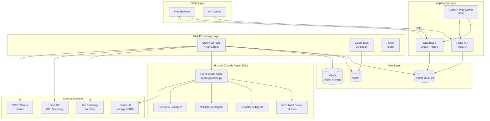
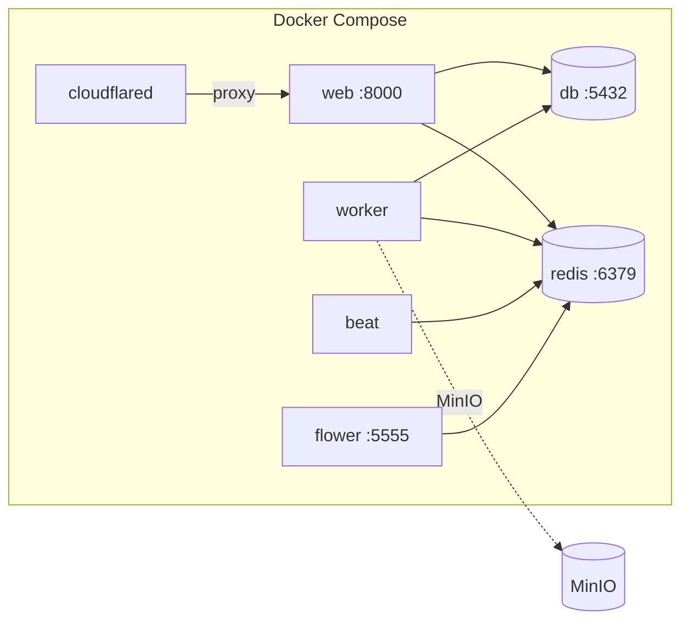
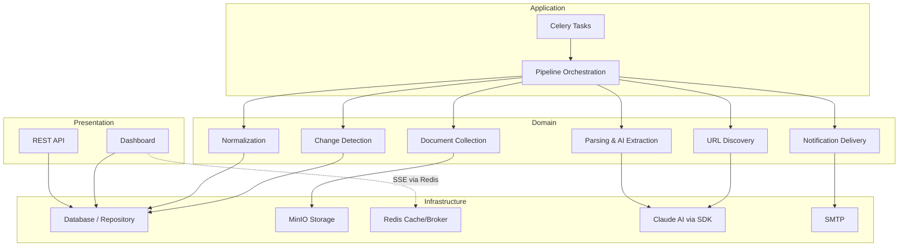

# Architecture Overview

[← Home](Home.md)

## System Architecture



## Service Topology (Docker Compose)

ExNot runs as 7 containers orchestrated by Docker Compose:

| Service | Image / Command | Port | Purpose |
|---------|----------------|------|---------|
| **web** | `uvicorn exnot.api.app:app` | 8000 | FastAPI app serving API + Dashboard |
| **worker** | `celery worker -c 4` | — | Processes scraping, parsing, notification tasks |
| **beat** | `celery beat` | — | Cron-like periodic task scheduler |
| **flower** | `celery flower` | 5555 | Celery task monitoring UI |
| **db** | `postgres:16-alpine` | 5432 | Primary data store |
| **redis** | `redis:7-alpine` | 6379 | Celery broker + result backend + pub/sub |
| **cloudflared** | Cloudflare tunnel | — | Production TLS ingress |



## Module Map

```
src/exnot/
├── config.py              # Central configuration (pydantic-settings)
├── agents/                # Claude Agent SDK pipeline layer
│   ├── pipeline.py        # Orchestrator pipeline (entry point, run_exchange_pipeline)
│   ├── streaming.py       # SSE streaming via Redis pub/sub (worker→web bridge)
│   ├── tools/             # MCP tool definitions (11 tools + server.py)
│   ├── subagents/         # AgentDefinition configs (extractor, validator, discovery)
│   └── prompts/           # 18 exchange-specific prompt files + registry.py
├── api/                   # FastAPI routes + schemas
├── dashboard/             # Jinja2 templates + static assets
├── db/                    # SQLAlchemy models + repository layer
├── discovery/             # Fee schedule URL discovery (SerpAPI)
├── exchanges/             # Exchange registry + YAML definitions
├── parser/                # PDF/HTML/CSV parsing + table classification
├── profiles/              # Zero-cost re-extraction profiles
├── normalizer/            # Canonical fee schema + mapping engine
├── differ/                # Change detection + comparison + reporting
├── notifications/         # Email delivery + templates
├── scraper/               # HTTP + Playwright document fetching
├── storage/               # MinIO client for raw document storage
└── workers/               # Celery app, tasks, schedules, pipelines
```

## Layer Architecture



## Key Design Decisions

### Async/Sync Bridge

The web server is fully async (asyncpg, httpx). Celery workers are synchronous — they use `asyncio.run()` to bridge into async scraping and email code. This gives Celery's reliable task execution model without sacrificing async I/O for network-heavy operations.

### Repository Pattern

All database access goes through `db/repositories.py`. Route handlers and pipeline code never construct raw queries. Each entity type has a dedicated repository class with typed async methods.

### Per-Exchange Configuration

Each exchange is defined in a YAML file (`exchanges/definitions/`) specifying its URL, document format, scraper type, and parser hints. Exchange-specific AI prompts live in `agents/prompts/`. This separation means adding a new exchange requires only a YAML file and an optional prompt — no code changes.

### Budget-Aware AI

Pipeline costs are tracked via `ResultMessage` from the Claude Agent SDK, which reports `total_cost_usd`, `total_tokens`, and `num_turns`. Per-exchange and daily budget guardrails (`AI_BUDGET_PER_EXCHANGE_USD`, `AI_BUDGET_DAILY_USD`) prevent runaway costs.

### Real-Time Event Streaming

Pipeline events are streamed from the Celery worker to the web dashboard via Redis pub/sub. Events are also persisted to Redis lists (24h TTL) for replay. The monitor page shows live progress for running pipelines and expandable logs for completed runs.

## Related Pages

- [Pipeline Deep Dive](Pipeline-Deep-Dive.md) — detailed flow of each pipeline stage
- [AI Agent System](AI-Agent-System.md) — how the agents coordinate
- [Worker Architecture](Worker-Architecture.md) — Celery task design
- [Database Schema](Database-Schema.md) — data model
