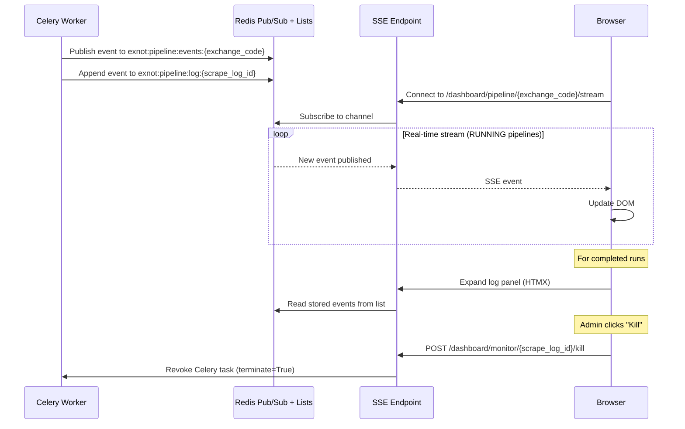

# Dashboard & Monitoring

[← Home](Home.md) | [API Reference](API-Reference.md)

## Overview

ExNot provides a server-rendered web dashboard at `/dashboard/` using Jinja2 templates, HTMX for dynamic updates, and Tailwind CSS (CDN) for styling. The dashboard includes a real-time agent monitoring system using Server-Sent Events (SSE).

## Dashboard Pages

```mermaid
graph TD
    Login[/dashboard/login] --> Dashboard[/dashboard]
    Dashboard --> ExchangeDetail[/dashboard/exchanges/:code]
    Dashboard --> Compare[/dashboard/compare]
    Dashboard --> Changes[/dashboard/changes]
    Dashboard --> Monitor[/dashboard/monitor<br/>Admin only]
    Dashboard --> Subscribe[/dashboard/subscribe]

    Monitor --> Events[/dashboard/monitor/events/:run_id<br/>HTMX fragment]
    Monitor -.->|SSE| Stream[/dashboard/monitor/stream]

    ExchangeDetail --> Download[/dashboard/exchanges/:code/<br/>documents/:doc_id/download]

    style Monitor fill:#E91E63,color:white
    style Stream fill:#E91E63,color:white
```

### Main Dashboard (`/dashboard`)

Overview page showing:
- All exchanges with status indicators (last scrape time, latest version)
- Recent fee changes across all exchanges
- Quick links to trigger scrapes (admin)

### Exchange Detail (`/dashboard/exchanges/{code}`)

Detailed view of a single exchange:
- Current normalized fees table (filterable by participant type, fee type, etc.)
- Version history with confidence scores and AI costs
- Scraped documents with download links
- V3 dimension filters (origin code, liquidity role, product type)

### Fee Comparison (`/dashboard/compare`)

Side-by-side fee comparison across multiple exchanges:
- Multi-select exchange picker
- Filter by participant type, security class, order type, fee type
- V3 dimension filters
- Results displayed in a comparison grid

### Change History (`/dashboard/changes`)

Filterable change log:
- Filter by exchange, change type (NEW/MODIFIED/REMOVED), date range
- Shows old vs. new amounts for modified fees
- Links to affected exchange detail pages

### Subscription Management (`/dashboard/subscribe`, `/dashboard/unsubscribe`)

Public pages for email subscription signup and removal:
- Frequency selection (Immediate, Daily Digest, Weekly)
- Exchange filter (all or specific exchanges)
- Email-based unsubscribe

## Real-Time Agent Monitoring

The monitoring system provides live visibility into AI extraction pipelines. **Admin-only access**.

### Architecture



### Event Flow

1. **Worker** publishes events to Redis pub/sub (`exnot:pipeline:events:{exchange_code}`) and persists them to Redis lists (`exnot:pipeline:log:{scrape_log_id}`, 24h TTL)
2. **SSE endpoint** (`/dashboard/pipeline/{exchange_code}/stream`) subscribes to the Redis channel for live events
3. For **completed runs**, stored events are read from Redis lists when the user expands a log panel
4. Events are streamed as JSON to the browser via SSE (powered by `sse-starlette`)
5. The monitor page uses inline expandable rows — live SSE for RUNNING status, stored logs for completed runs

### Event Types Displayed

| Event | Display |
|-------|---------|
| `info` | Pipeline progress messages (started, tool calls, completions) |
| `error` | Red error with message (pipeline failures, SDK errors) |
| `tool_call` | MCP tool invocations (scrape, parse, normalize, etc.) |
| `subagent` | Subagent delegation (extractor, validator, discovery) |
| `complete` | Green checkmark with total cost and token summary |

### Run Events Detail View

Clicking a run expands to show all events via HTMX fragment:
```
GET /dashboard/monitor/events/{run_id}
```
Returns an HTML fragment (not a full page) that HTMX inserts into the run card.

### Kill Support

Admins can kill running pipelines via the monitor UI:
- Kill button revokes the Celery task via `celery_app.control.revoke(id, terminate=True)`
- ScrapeLog is updated to `FAILED` with "Manually killed" error message
- The `celery_task_id` stored in ScrapeLog enables task identification for revocation

## HTMX Patterns

The dashboard uses HTMX for dynamic interactions without a JavaScript framework:

```html
<!-- Example: Filter fees table -->
<select hx-get="/dashboard/exchanges/CBOE_BZX"
        hx-target="#fees-table"
        hx-include="[name='participant_type'],[name='fee_type']"
        name="participant_type">
    <option value="">All</option>
    <option value="CUSTOMER">Customer</option>
</select>

<!-- Example: HTMX SSE for monitoring -->
<div hx-ext="sse"
     sse-connect="/dashboard/monitor/stream"
     sse-swap="message">
</div>
```

## Template Structure

```
dashboard/templates/
├── base.html              # Base layout (nav, Tailwind CDN, HTMX)
├── dashboard.html         # Main overview page
├── exchange.html          # Exchange detail view
├── comparison.html        # Cross-exchange comparison
├── changes.html           # Change history
├── subscribe.html         # Subscription signup
├── unsubscribe.html       # Email unsubscribe
├── login.html             # Admin login form
├── monitor.html           # Real-time monitoring (admin)
└── monitor_events.html    # HTMX fragment for run events
```

## Document Downloads

Raw scraped documents (PDFs, HTML snapshots) stored in MinIO can be downloaded:

```
GET /dashboard/exchanges/{code}/documents/{doc_id}/download
```

Streams the file from MinIO as an attachment with the original filename.

## Related Pages

- [API Reference](API-Reference.md) — REST endpoints the dashboard calls
- [AI Agent System](AI-Agent-System.md) — what the monitor displays
- [Worker Architecture](Worker-Architecture.md) — task execution model
