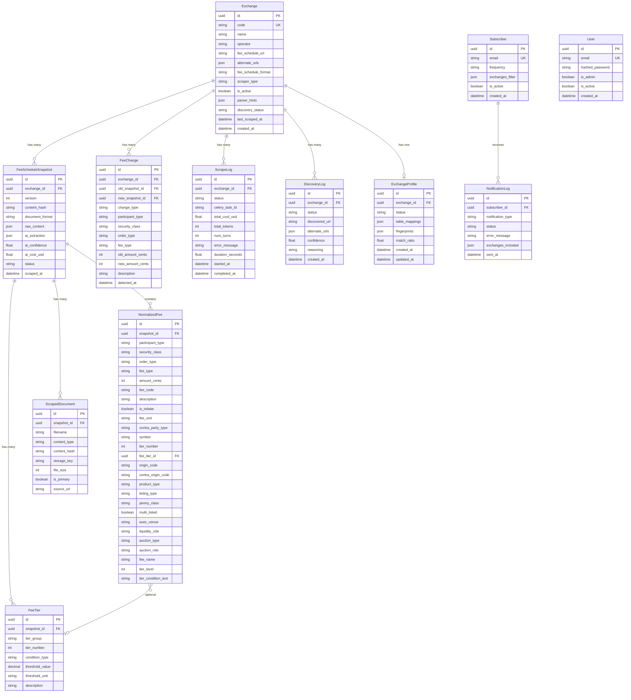

# Database Schema

[← Home](Home.md) | [Architecture Overview](Architecture-Overview.md)

## Entity Relationship Diagram



## Core Models

### Exchange

The central entity. Each of the 19 US options exchanges has one record, seeded from YAML definitions on startup.

**Key fields**:
- `code` — unique identifier (e.g., `CBOE_BZX`, `NYSE_ARCA`)
- `fee_schedule_url` — primary URL to scrape
- `fee_schedule_format` — `PDF`, `HTML`, `CSV`, or `EXCEL`
- `scraper_type` — `HTTP` or `BROWSER` (Playwright)
- `discovery_status` — `DISCOVERED`, `PENDING`, `FAILED`
- `parser_hints` — JSONB with `has_volume_tiers`, `has_index_options`, etc.

### FeeScheduleSnapshot

A versioned snapshot of an exchange's fee schedule. Created each time a content change is detected.

**Key fields**:
- `version` — auto-incrementing per exchange
- `content_hash` — SHA-256 of primary document (used for change detection)
- `ai_extraction` — JSONB storing the raw AI extraction result + cost summary
- `ai_confidence` — 0.0–1.0 confidence score from the validator agent
- `ai_cost_usd` — total LLM cost for this extraction

### NormalizedFee

Individual fee entries mapped to the canonical schema. This is the primary query table for the API and dashboard.

**Amount storage**: `amount_cents` is an integer representing hundredths of a cent (1/10,000th of a dollar).

| Dollar Amount | `amount_cents` Value |
|--------------|---------------------|
| $0.45 | 4500 |
| $0.0012 | 12 |
| -$0.25 (rebate) | -2500 |

**V3 dimension columns** (all nullable, for forward-compatible extraction):
- `origin_code`, `contra_origin_code` — participant classification
- `product_type`, `listing_type`, `penny_class` — security classification
- `exec_venue`, `liquidity_role` — execution context
- `auction_type`, `auction_role` — auction-specific
- `fee_name`, `tier_level`, `tier_condition_text` — tier metadata

### FeeChange

Records detected differences between consecutive snapshots. Used for notifications and the changes dashboard.

**`change_type`**: `NEW`, `MODIFIED`, `REMOVED`

### ScrapeLog

Tracks pipeline execution lifecycle. Status enum: `RUNNING`, `SUCCESS`, `FAILED`, `NO_CHANGE`.

**Key fields**:
- `celery_task_id` — Celery task ID for kill support (admin can revoke via monitor UI)
- `total_cost_usd` — Total Claude AI cost from `ResultMessage`
- `total_tokens` — Total tokens consumed
- `num_turns` — Number of agent turns in the pipeline
- `error_message` — Error details if failed (enriched with SDK stderr output)

**Real-time events** are NOT stored in PostgreSQL. Instead, they are:
1. Published to Redis pub/sub channels (`exnot:pipeline:events:{exchange_code}`)
2. Persisted to Redis lists (`exnot:pipeline:log:{scrape_log_id}`) with 24h TTL
3. Streamed to dashboard via SSE for live monitoring

## Enums

### ParticipantType
`CUSTOMER`, `PROFESSIONAL`, `MARKET_MAKER`, `AWAY_MARKET_MAKER`, `FIRM`, `BROKER_DEALER`, `NON_CUSTOMER`, `ALL`

### SecurityClass
`PENNY`, `NON_PENNY`, `INDEX`, `ETF`, `EQUITY`, `MINI`, `SPY`, `QQQ`, `IWM`, `NDX`, `RUT`, `VIX`, `ALL`

### OrderType
`SIMPLE`, `COMPLEX`, `AUCTION`, `DIRECTED`, `QCC`, `PIM`, `CROSSING`, `FLEX`, `OPENING`, `ROUTED`, `ALL`

### FeeType
`MAKER`, `TAKER`, `ROUTING`, `ORF`, `TRANSACTION`, `CLEARING`, `CONNECTIVITY`, `MARKET_DATA`, `MEMBERSHIP`, `CROSSING_FEE`, `PIM_FEE`, `RESPONSE_FEE`, `BREAK_UP_REBATE`, `SURCHARGE`, `CANCELLATION`, `STOCK_HANDLING`

### FeeUnit
`PER_CONTRACT`, `PER_CONTRACT_SIDE`, `PER_SHARE`, `MONTHLY_FLAT`, `PER_PORT_MONTHLY`, `PERCENTAGE`, `PER_ORDER`

## Repository Pattern

All database access goes through `db/repositories.py`. Key repository classes:

| Repository | Entity | Key Methods |
|-----------|--------|-------------|
| `ExchangeRepository` | Exchange | `get_by_code()`, `get_all_active()`, `update_url()` |
| `SnapshotRepository` | FeeScheduleSnapshot | `get_latest()`, `get_by_version()`, `create()` |
| `NormalizedFeeRepository` | NormalizedFee | `get_by_snapshot()`, `bulk_create()`, `query_with_filters()` |
| `FeeChangeRepository` | FeeChange | `get_recent()`, `get_by_exchange()`, `bulk_create()` |
| `SubscriberRepository` | Subscriber | `get_by_frequency()`, `get_by_email()` |
| `ScrapeLogRepository` | ScrapeLog | `create()`, `update_status()`, `get_recent()`, `get_running()` |

All methods are async, accepting an `AsyncSession` parameter.

## Migrations

Alembic manages schema migrations:

```bash
# Apply all migrations
alembic upgrade head

# Create a new migration
alembic revision --autogenerate -m "description"

# Check current version
alembic current
```

Migration files are in `alembic/versions/`.

## Related Pages

- [Normalization Engine](Normalization-Engine.md) — how fees map to this schema
- [API Reference](API-Reference.md) — how this data is exposed
- [Pipeline Deep Dive](Pipeline-Deep-Dive.md) — how data flows through the system
