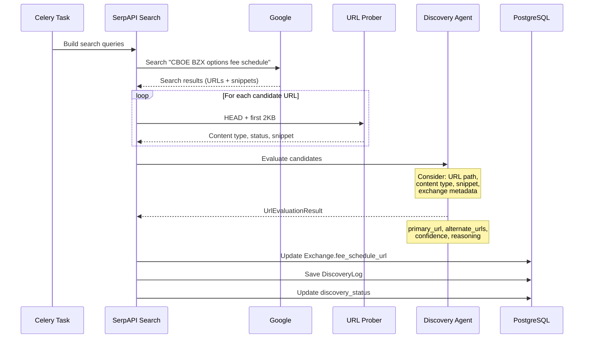
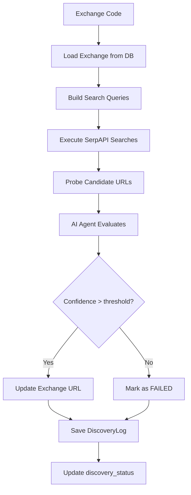

# Discovery System

[← Home](Home.md) | [Pipeline Deep Dive](Pipeline-Deep-Dive.md)

## Overview

The discovery system automatically finds fee schedule URLs for exchanges using SerpAPI-powered Google search combined with AI-based URL evaluation. This handles cases where exchange URLs change or when onboarding new exchanges.

## Discovery Pipeline



## Components

### Search (`discovery/search.py`)

Builds 2–3 search queries per exchange using exchange name and operator:

```python
queries = [
    f"{exchange_name} options fee schedule",
    f"{operator} {exchange_name} fee schedule site:{known_domain}",
    f"{exchange_name} options transaction fees"
]
```

Uses SerpAPI to execute Google searches and collect candidate URLs with their snippets.

### URL Probing

Each candidate URL is probed before AI evaluation:
1. **HEAD request** — checks status code and Content-Type
2. **First 2KB fetch** — provides a content snippet for the AI to evaluate
3. Filters out obviously irrelevant URLs (non-200 status, non-document types)

### Discovery Subagent (`agents/subagents/discovery.py`)

A Claude Agent SDK subagent (`AgentDefinition`) that evaluates the candidate URL list. The orchestrator delegates to it via the `Task` tool. Input includes:
- List of candidate URLs with snippets and content types
- Exchange metadata (name, operator, current URL if any)

Returns JSON:
```json
{
  "primary_url": "https://...",
  "alternate_urls": ["https://..."],
  "recommended_format": "PDF",
  "confidence": 0.85,
  "reasoning": "Official exchange domain with direct fee schedule link"
}
```

### Pipeline (`discovery/pipeline.py`)

`run_discovery_pipeline` wraps the async discovery flow for synchronous Celery execution:



## Discovery Status

Each exchange has a `discovery_status` field:

| Status | Meaning |
|--------|---------|
| `DISCOVERED` | URL confirmed and active |
| `PENDING` | Not yet attempted |
| `FAILED` | Discovery attempted but no confident result |

The pipeline skips exchanges with `DISCOVERED` status unless explicitly triggered.

## Tasks

| Task | Rate Limit | Retries | Description |
|------|-----------|---------|-------------|
| `discover_exchange_urls` | 3/min | 2 | Discover URL for one exchange |
| `discover_all_exchange_urls` | — | — | Fan-out: dispatches discovery for all undiscovered/failed exchanges |

Rate limiting prevents SerpAPI quota exhaustion.

## When Discovery Runs

1. **Manual trigger**: Admin API `POST /api/v1/admin/discover/{code}`
2. **Pipeline check**: `run_scrape_pipeline` calls discovery if `discovery_status != DISCOVERED`
3. **Bulk discovery**: Admin triggers `discover_all_exchange_urls`

## Related Pages

- [Exchange Definitions](Exchange-Definitions.md) — where URLs are initially defined
- [AI Agent System](AI-Agent-System.md) — discovery agent details
- [Worker Architecture](Worker-Architecture.md) — task definitions
- [Configuration Guide](Configuration-Guide.md) — SerpAPI key
