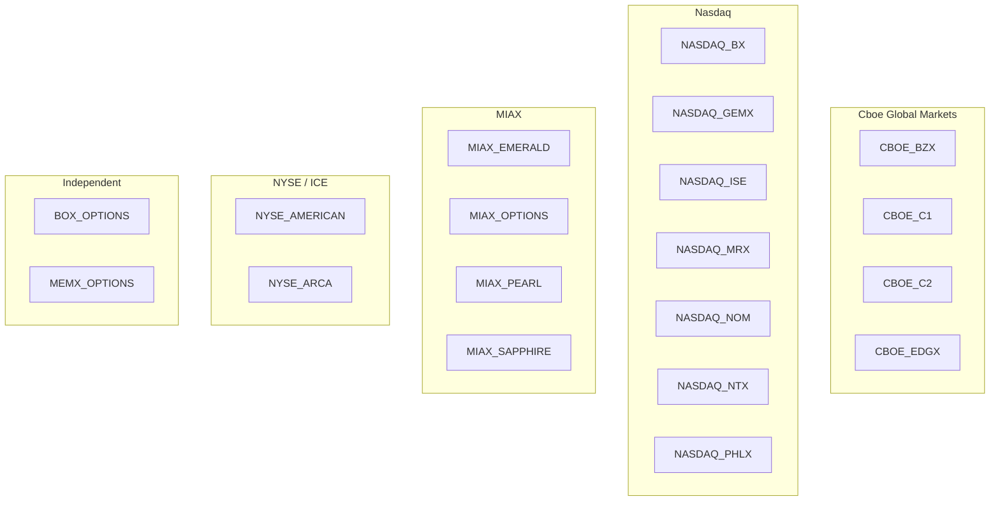
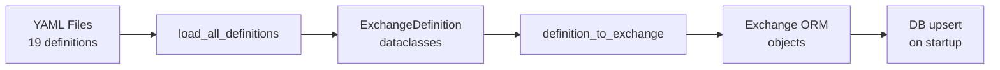

# Exchange Definitions

[← Home](Home.md) | [Architecture Overview](Architecture-Overview.md)

## Overview

Each of the 19 US options exchanges is defined by a YAML file in `src/exnot/exchanges/definitions/`. These files are the single source of truth for exchange metadata, scraping configuration, and parser hints.

## YAML Format

```yaml
# Example: src/exnot/exchanges/definitions/cboe_bzx.yml
code: CBOE_BZX
name: "Cboe BZX Options Exchange"
operator: "Cboe Global Markets"
fee_schedule_url: "https://www.cboe.com/us/options/membership/fee_schedule/bzx/"
alternate_urls:
  - "https://www.cboe.com/us/options/membership/fee_schedule/bzx/pdf/"
fee_schedule_format: HTML    # PDF | HTML | CSV | EXCEL
scraper_type: HTTP           # HTTP | BROWSER
is_active: true
parser_hints:
  has_volume_tiers: true
  has_index_options: false
  has_mini_options: false
  primary_table_count: 3
```

### Field Reference

| Field | Required | Description |
|-------|----------|-------------|
| `code` | Yes | Unique identifier (e.g., `CBOE_BZX`). Used as the primary key across the system. |
| `name` | Yes | Full exchange name |
| `operator` | Yes | Parent company operating the exchange |
| `fee_schedule_url` | Yes | Primary URL to scrape for fee data |
| `alternate_urls` | No | Additional URLs with supplementary fee data |
| `fee_schedule_format` | Yes | Expected document format: `PDF`, `HTML`, `CSV`, or `EXCEL` |
| `scraper_type` | Yes | `HTTP` (httpx, for static pages) or `BROWSER` (Playwright, for JS-rendered) |
| `is_active` | Yes | Whether to include in automated scraping runs |
| `parser_hints` | No | JSONB hints for the parser/AI extractor |

### Parser Hints

| Hint | Type | Description |
|------|------|-------------|
| `has_volume_tiers` | bool | Exchange uses volume-based fee tiers |
| `has_index_options` | bool | Separate fee schedule for index options |
| `has_mini_options` | bool | Mini option contract fees |
| `primary_table_count` | int | Expected number of fee tables (helps validation) |

## Exchanges Covered



## Registry (`exchanges/registry.py`)

The registry loads all YAML definitions and seeds the database:



**Key functions**:
- `load_all_definitions()` — reads all YAML files, returns list of `ExchangeDefinition` dataclasses
- `definition_to_exchange(definition)` — converts to SQLAlchemy `Exchange` model
- Called during app startup to ensure all exchanges exist in the database

## Adding a New Exchange

1. **Create YAML definition**:
   ```bash
   # src/exnot/exchanges/definitions/new_exchange.yml
   code: NEW_EXCHANGE
   name: "New Options Exchange"
   operator: "Exchange Operator Inc"
   fee_schedule_url: "https://example.com/fees"
   fee_schedule_format: PDF
   scraper_type: HTTP
   is_active: true
   ```

2. **Create exchange prompt** (optional but recommended):
   ```python
   # src/exnot/agents/prompts/new_exchange.py
   PROMPT = """
   ## NEW_EXCHANGE Fee Schedule Structure
   - Tables are organized by participant type...
   - Fee codes use the prefix "NE"...
   """
   ```

3. **Register the prompt** in `src/exnot/agents/prompts/registry.py`:
   ```python
   from .new_exchange import PROMPT as NEW_EXCHANGE_PROMPT

   EXCHANGE_PROMPTS = {
       ...
       "NEW_EXCHANGE": NEW_EXCHANGE_PROMPT,
   }
   ```

4. **Restart the app** — the registry auto-seeds the new exchange into the database on startup.

No code changes are required beyond the prompt registration. The pipeline, normalization, and change detection all work generically.

## Document Format Considerations

| Format | Parser | Best For |
|--------|--------|----------|
| `HTML` | BeautifulSoup | Exchanges with web-based fee pages (most common) |
| `PDF` | PyMuPDF + pdfplumber | Exchanges publishing fee schedules as PDF documents |
| `CSV` | Python csv | MIAX exchanges that provide structured CSV data |
| `EXCEL` | (via CSV conversion) | Not yet implemented; planned for future |

## Scraper Type Selection

- **HTTP**: Default. Uses `httpx` with configurable timeouts, retries, and user-agent. Suitable for static HTML and direct file downloads.
- **BROWSER**: Uses Playwright headless Chromium. Required for exchanges that render fee tables via JavaScript or require cookie/session handling.

## Related Pages

- [Pipeline Deep Dive](Pipeline-Deep-Dive.md) — how exchanges flow through the pipeline
- [AI Agent System](AI-Agent-System.md) — per-exchange prompts
- [Configuration Guide](Configuration-Guide.md) — scraper settings
