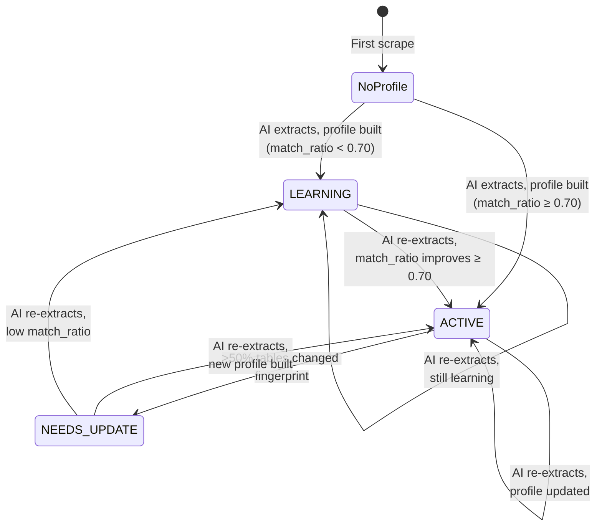
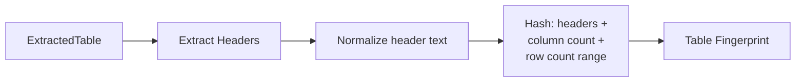
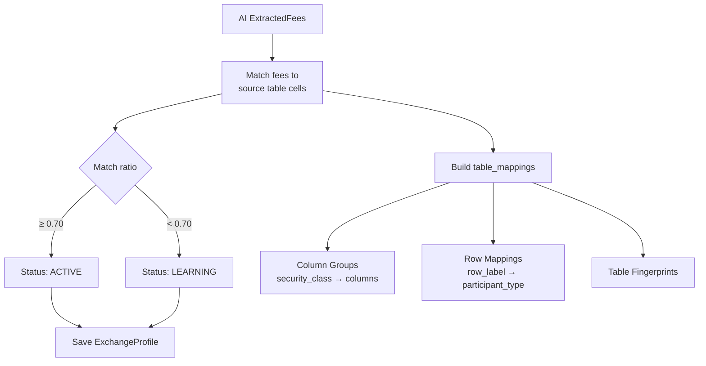
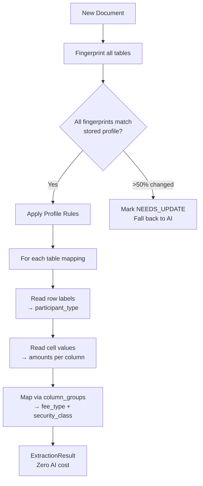
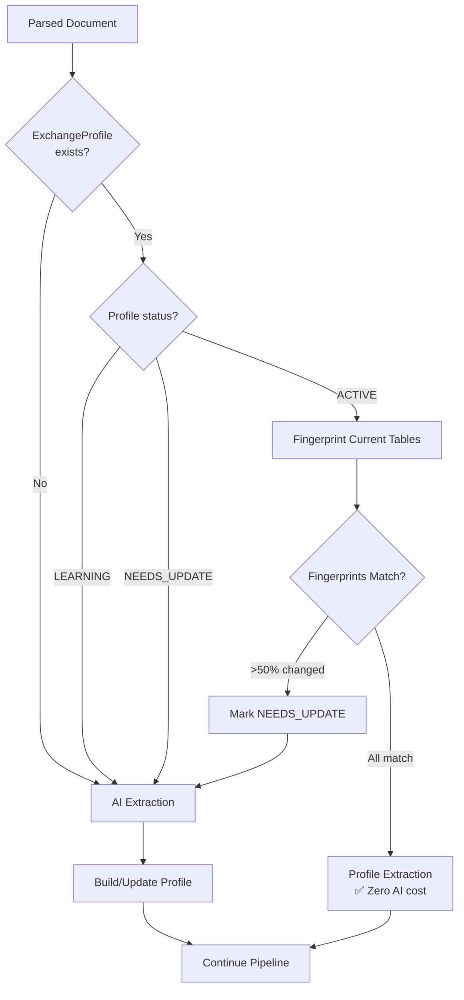

# Extraction Profiles

[← Home](Home.md) | [Pipeline Deep Dive](Pipeline-Deep-Dive.md)

## Overview

The extraction profiles system enables **zero-cost re-extraction** of fee schedules when the document structure hasn't changed. Since fee schedules are typically stable tabular documents — amounts change but layouts rarely do — profiles can handle most re-extractions without any AI API calls.

## Profile Lifecycle



## How It Works

### Step 1: Fingerprinting Tables

Each table in a document is fingerprinted by hashing its structure:



**`profiles/fingerprint.py`** produces a deterministic fingerprint that changes when the table layout changes (added/removed columns, renamed headers) but stays stable when only cell values change.

### Step 2: Building a Profile (After AI Extraction)

After AI successfully extracts fees, `ProfileBuilder` maps AI results back to source tables:



**Profile data structure** (`ExchangeProfile.table_mappings`):

```json
{
  "tables": [
    {
      "table_index": 0,
      "fingerprint": "a1b2c3...",
      "row_axis_col": 0,
      "column_groups": [
        {
          "security_class": "PENNY",
          "columns": [
            {"header": "Maker", "fee_type": "MAKER", "col_index": 1},
            {"header": "Taker", "fee_type": "TAKER", "col_index": 2}
          ]
        }
      ],
      "row_mappings": {
        "Customer": "CUSTOMER",
        "Professional": "PROFESSIONAL",
        "Market Maker": "MARKET_MAKER",
        "Firm": "FIRM"
      }
    }
  ]
}
```

### Step 3: Profile-Based Extraction (Zero AI Cost)

On subsequent runs, if the profile is ACTIVE:



**`profiles/extractor.py: extract_all_from_profile`**:
1. Compares current table fingerprints against stored fingerprints
2. If all match → iterates through `table_mappings`:
   - Row labels → `participant_type` (via `row_mappings`)
   - Cell values → `amount` (parsed as Decimal)
   - Column position → `fee_type` + `security_class` (via `column_groups`)
3. Returns `ExtractionResult` with all fees, no AI calls made

### Decision Flow in Pipeline



## Match Ratio

The `match_ratio` measures how well AI-extracted fees could be mapped back to source table cells:

- **≥ 0.70**: Profile is ACTIVE — sufficient coverage for reliable rules-based extraction
- **< 0.70**: Profile stays in LEARNING — AI extraction will be used, and the profile will be rebuilt

Factors that lower match_ratio:
- Fees extracted from footnotes or free text (not in tables)
- Complex multi-table layouts with cross-references
- Merged cells or irregular table structures

## Cost Impact

For a typical exchange with 50+ fees:

| Extraction Method | API Calls | Est. Cost |
|-------------------|-----------|-----------|
| Full AI extraction (Claude Agent SDK) | 1 pipeline run | $0.10–$0.50 |
| Profile extraction | 0 calls | $0.00 |

Over 19 exchanges running daily, profiles can save **$2–$10/day** once all exchanges have active profiles.

## Related Pages

- [Pipeline Deep Dive](Pipeline-Deep-Dive.md) — where profiles fit in the pipeline
- [AI Agent System](AI-Agent-System.md) — the AI extraction that builds profiles
- [Exchange Definitions](Exchange-Definitions.md) — per-exchange configuration
