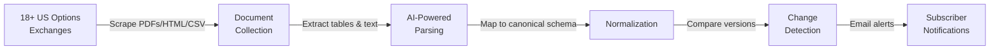

# ExNot Wiki

**ExNot** (Exchange Notifications) is an AI-agentic system that automatically collects, parses, normalizes, and monitors fee schedules from all 18+ US options exchanges. It detects changes and notifies subscribers in real time.

## Quick Navigation

| Document | Description |
|----------|-------------|
| [Architecture Overview](Architecture-Overview.md) | System topology, tech stack, service map |
| [Pipeline Deep Dive](Pipeline-Deep-Dive.md) | Scrape → Parse → Normalize → Diff → Notify |
| [AI Agent System](AI-Agent-System.md) | Claude Agent SDK orchestrator, MCP tools, subagents, per-exchange prompts |
| [Database Schema](Database-Schema.md) | ER diagram, all models, relationships, enums |
| [API Reference](API-Reference.md) | REST endpoints, auth, request/response examples |
| [Dashboard & Monitoring](Dashboard-and-Monitoring.md) | Dashboard pages, SSE live monitoring, HTMX |
| [Exchange Definitions](Exchange-Definitions.md) | YAML format, registry, adding new exchanges |
| [Worker Architecture](Worker-Architecture.md) | Celery queues, tasks, beat schedule, deduplication |
| [Configuration Guide](Configuration-Guide.md) | All env vars, Claude SDK models, budget tuning |
| [Extraction Profiles](Extraction-Profiles.md) | Zero-cost re-extraction, fingerprinting, profile lifecycle |
| [Normalization Engine](Normalization-Engine.md) | V2/V3 schema, fee taxonomy, amount storage |
| [Discovery System](Discovery-System.md) | URL discovery pipeline, SerpAPI integration |
| [Development Guide](Development-Guide.md) | Local setup, testing, linting, migrations |

## What ExNot Does

## Tech Stack at a Glance

| Layer | Technology |
|-------|-----------|
| **API & Dashboard** | FastAPI + Jinja2 + HTMX + Tailwind CSS |
| **Database** | PostgreSQL 16 (async via SQLAlchemy 2.x + asyncpg) |
| **Task Queue** | Celery 5.x + Redis broker |
| **AI/LLM** | Claude Agent SDK (`claude-agent-sdk`) — orchestrator + MCP tools + subagents |
| **PDF Parsing** | PyMuPDF (fitz) + pdfplumber |
| **Web Scraping** | httpx + BeautifulSoup4 + Playwright |
| **Object Storage** | MinIO |
| **Email** | aiosmtplib |
| **Containerization** | Docker Compose (7 services) |

## Exchanges Covered

CBOE (BZX, C1, C2, EDGX) · NASDAQ (BX, GEMX, ISE, MRX, NOM, NTX, PHLX) · MIAX (Emerald, Options, Pearl, Sapphire) · NYSE (American, Arca) · BOX Options · MEMX Options

## Getting Started

See the [Development Guide](Development-Guide.md) for local setup, or jump to [Architecture Overview](Architecture-Overview.md) to understand the system design.
