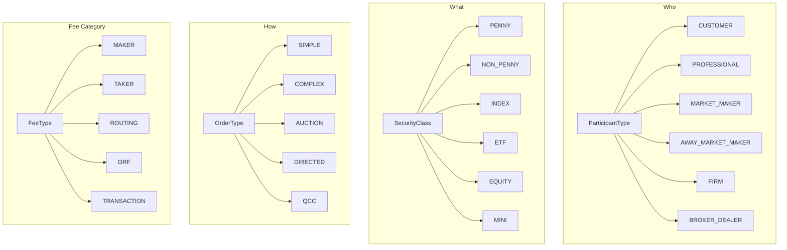
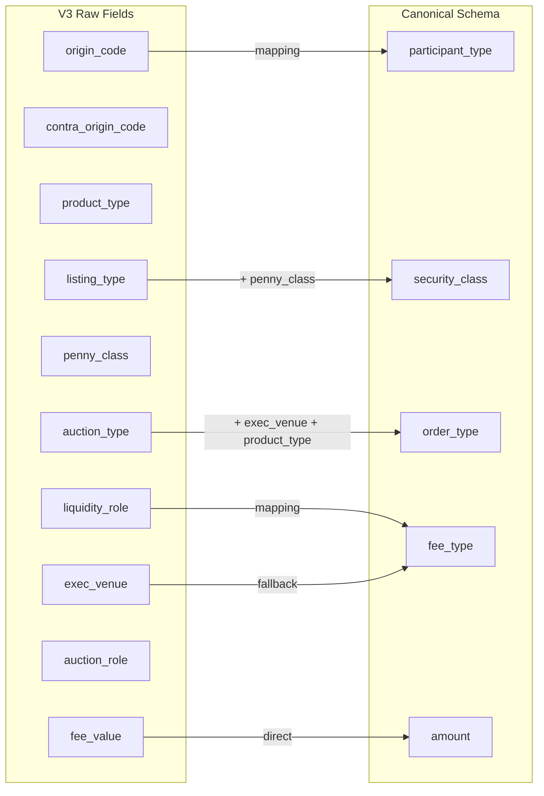
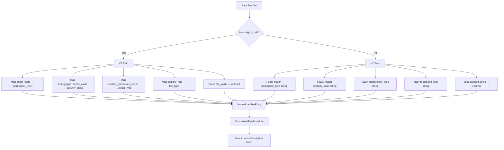

# Normalization Engine

[← Home](Home.md) | [Pipeline Deep Dive](Pipeline-Deep-Dive.md)

## Overview

The normalization engine maps raw extracted fee data (from AI or profiles) into a canonical schema. This enables cross-exchange comparison — different exchanges describe the same fee concepts using different terminology, and normalization resolves these differences.

## Fee Taxonomy



### Complete Enum Values

**ParticipantType** — Who is trading:
| Value | Description |
|-------|-------------|
| `CUSTOMER` | Public customer / Priority Customer |
| `PROFESSIONAL` | Professional customer |
| `MARKET_MAKER` | Registered market maker on this exchange |
| `AWAY_MARKET_MAKER` | Market maker registered on a different exchange |
| `FIRM` | Proprietary firm trading |
| `BROKER_DEALER` | Broker-dealer |
| `NON_CUSTOMER` | Catch-all for non-public-customer |
| `ALL` | Applies to all participant types |

**SecurityClass** — What is being traded:
| Value | Description |
|-------|-------------|
| `PENNY` | Penny pilot securities (penny increments) |
| `NON_PENNY` | Non-penny securities (nickel increments) |
| `INDEX` | Index options (SPX, NDX, etc.) |
| `ETF` | ETF options |
| `EQUITY` | Individual equity options |
| `MINI` | Mini option contracts |
| `SPY`, `QQQ`, `IWM`, `NDX`, `RUT`, `VIX` | Symbol-specific classes |
| `ALL` | Applies to all security classes |

**OrderType** — How the order is submitted:
| Value | Description |
|-------|-------------|
| `SIMPLE` | Standard single-leg order |
| `COMPLEX` | Multi-leg / spread order |
| `AUCTION` | Auction mechanism (NBBO improvement) |
| `DIRECTED` | Directed to specific market maker |
| `QCC` | Qualified Contingent Cross |
| `PIM` | Price Improvement Mechanism |
| `CROSSING` | Crossing order |
| `FLEX` | Flexible exchange options |
| `OPENING` | Opening rotation |
| `ROUTED` | Routed to another exchange |
| `ALL` | Applies to all order types |

**FeeType** — The fee category:
| Value | Description |
|-------|-------------|
| `MAKER` | Liquidity-adding fee/rebate |
| `TAKER` | Liquidity-removing fee |
| `ROUTING` | Fee for routing to another exchange |
| `ORF` | Options Regulatory Fee |
| `TRANSACTION` | Per-transaction fee |
| `CLEARING` | Clearing fee |
| `CONNECTIVITY` | Port/connectivity fee |
| `MARKET_DATA` | Market data fee |
| `MEMBERSHIP` | Membership/seat fee |
| `CROSSING_FEE` | Crossing transaction fee |
| `PIM_FEE` | Price Improvement Mechanism fee |
| `RESPONSE_FEE` | Auction response fee |
| `BREAK_UP_REBATE` | Break-up rebate for failed crosses |
| `SURCHARGE` | Additional surcharge |
| `CANCELLATION` | Order cancellation fee |
| `STOCK_HANDLING` | Stock leg handling fee |

**FeeUnit** — How the fee is measured:
`PER_CONTRACT`, `PER_CONTRACT_SIDE`, `PER_SHARE`, `MONTHLY_FLAT`, `PER_PORT_MONTHLY`, `PERCENTAGE`, `PER_ORDER`

## Amount Storage

All fee amounts are stored as `amount_cents` — an **integer** representing hundredths of a cent (1/10,000th of a dollar):

```
$0.45/contract  →  amount_cents = 4500
$0.0012          →  amount_cents = 12
-$0.25 (rebate)  →  amount_cents = -2500
$1.32            →  amount_cents = 13200
```

**Why integer storage?**
- Eliminates floating-point precision errors in fee comparisons
- Exact equality checks for change detection
- Hundredths-of-a-cent precision matches industry practice (sub-penny fees are common)

**Conversion** (in API response):
```python
amount = Decimal(amount_cents) / Decimal(10000)
```

## V2 vs V3 Schema

The system supports two extraction schemas. V3 is detected by the presence of `origin_code` in extracted data.

### V3 Schema (Current)

V3 uses exchange-native field names for more precise extraction:



**V3 → Canonical mappings**:

| V3 Field | Maps To | Logic |
|----------|---------|-------|
| `origin_code` | `participant_type` | `C` → CUSTOMER, `F` → FIRM, `M` → MARKET_MAKER, etc. |
| `listing_type` + `penny_class` | `security_class` | Combines listing info with penny/non-penny classification |
| `auction_type` + `exec_venue` + `product_type` | `order_type` | Priority: auction_type > exec_venue > product_type |
| `liquidity_role` | `fee_type` | `MAKER` → MAKER, `TAKER` → TAKER |
| `exec_venue` | `fee_type` (fallback) | When liquidity_role absent |
| `fee_value` | `amount` | Direct decimal mapping |

### V2 Schema (Legacy)

V2 uses human-readable field names that require fuzzy string matching:

```python
# V2 raw data example
{
    "participant_type": "Priority Customer",
    "security_class": "Penny Pilot",
    "order_type": "Simple",
    "fee_type": "Add Liquidity",
    "amount": "-0.25"
}
```

V2 normalization uses large lookup dictionaries for fuzzy mapping:
- `"Priority Customer"` → `CUSTOMER`
- `"Penny Pilot"` → `PENNY`
- `"Add Liquidity"` → `MAKER`

## Normalization Flow



## Rebate Handling

Rebates are fees paid BY the exchange TO the participant (incentivizing liquidity):

- Stored as **negative** `amount_cents`
- `is_rebate` flag set to `true`
- AI output validator auto-corrects sign/rebate consistency:
  - `fee_value < 0` → `is_rebate = True`
  - `is_rebate = True` and `fee_value > 0` → negate `fee_value`

## Volume Tiers

Some exchanges offer tiered pricing based on monthly trading volume. Tiers are stored in the `FeeTier` table:

```
FeeTier
├── tier_group: str       # Groups related tiers (e.g., "customer_maker_penny")
├── tier_number: int      # Order within group (1, 2, 3...)
├── condition_type: str   # "volume_threshold", "percentage_threshold"
├── threshold_value: Decimal
├── threshold_unit: str   # "contracts", "adv_percentage"
└── description: str      # Human-readable condition
```

Each `NormalizedFee` can optionally reference a `FeeTier` via `fee_tier_id`.

## Related Pages

- [Database Schema](Database-Schema.md) — NormalizedFee and FeeTier models
- [AI Agent System](AI-Agent-System.md) — how AI produces V3 output
- [Pipeline Deep Dive](Pipeline-Deep-Dive.md) — where normalization fits
- [Extraction Profiles](Extraction-Profiles.md) — profile-based extraction
