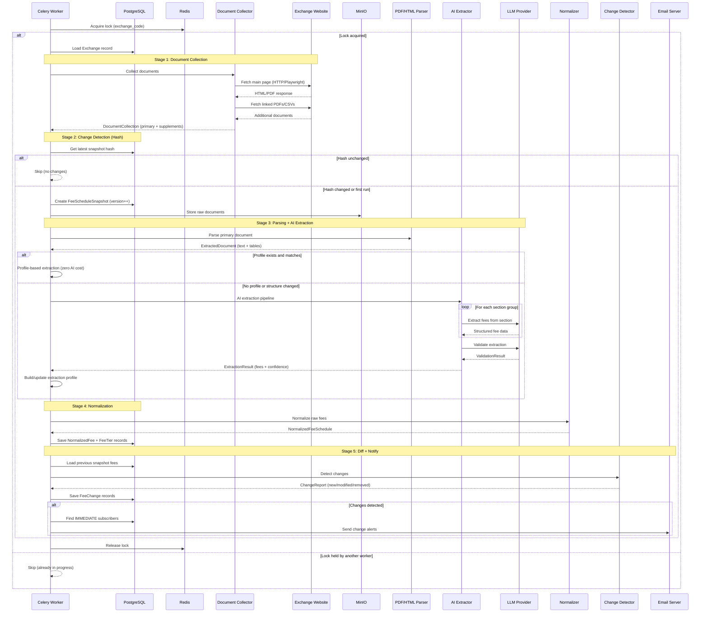
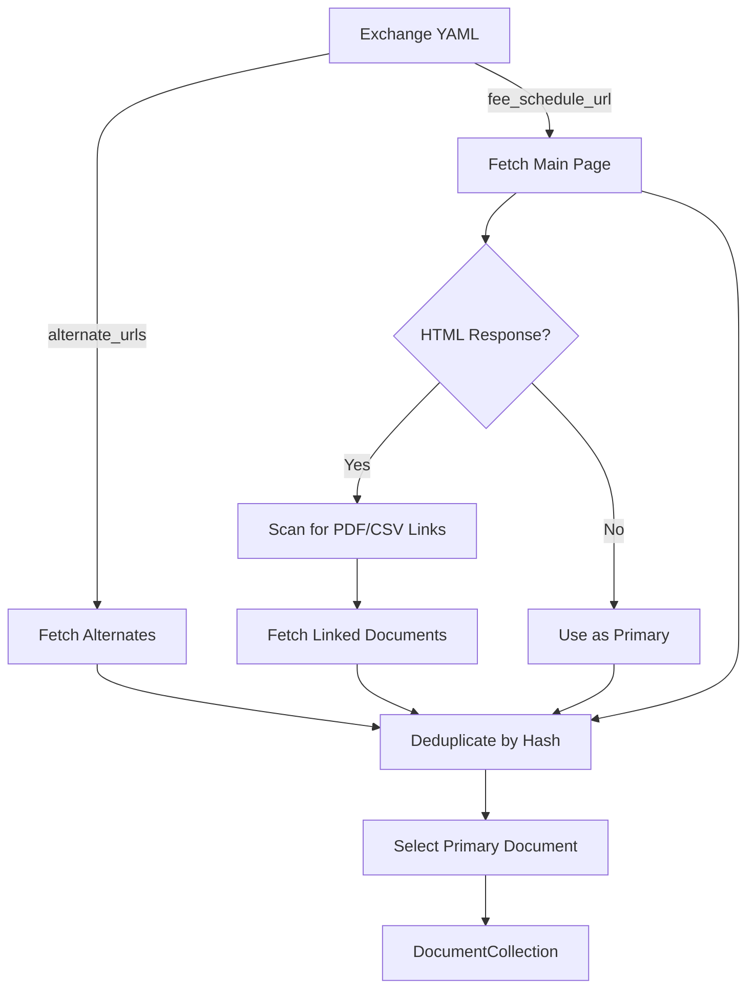
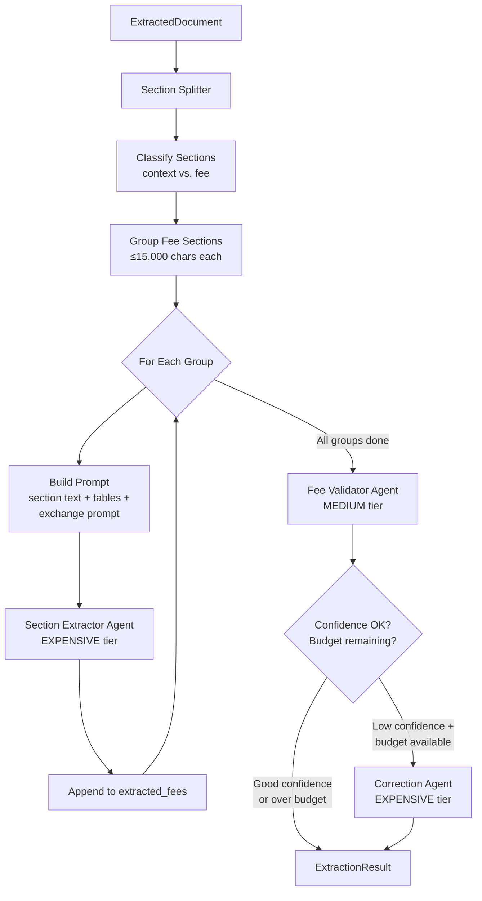
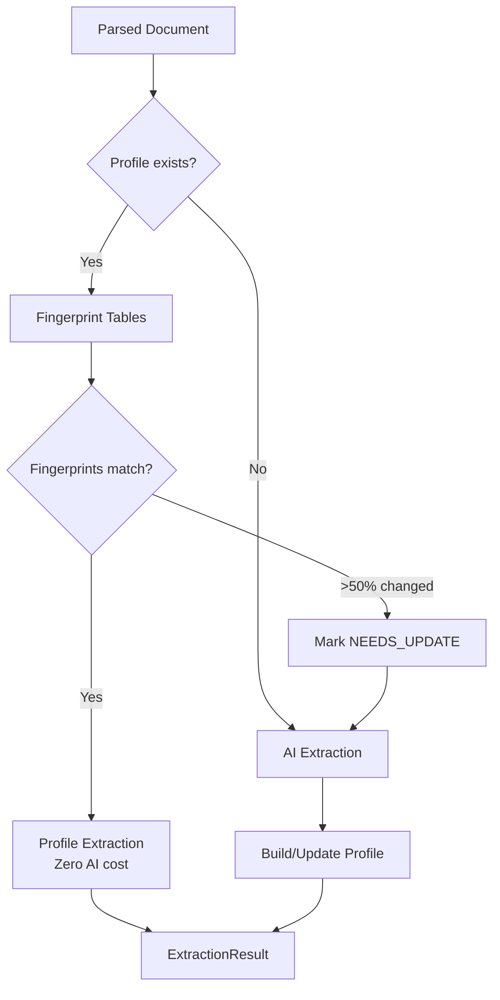
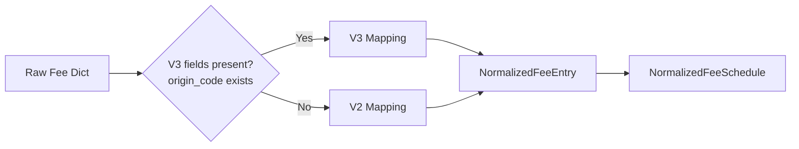
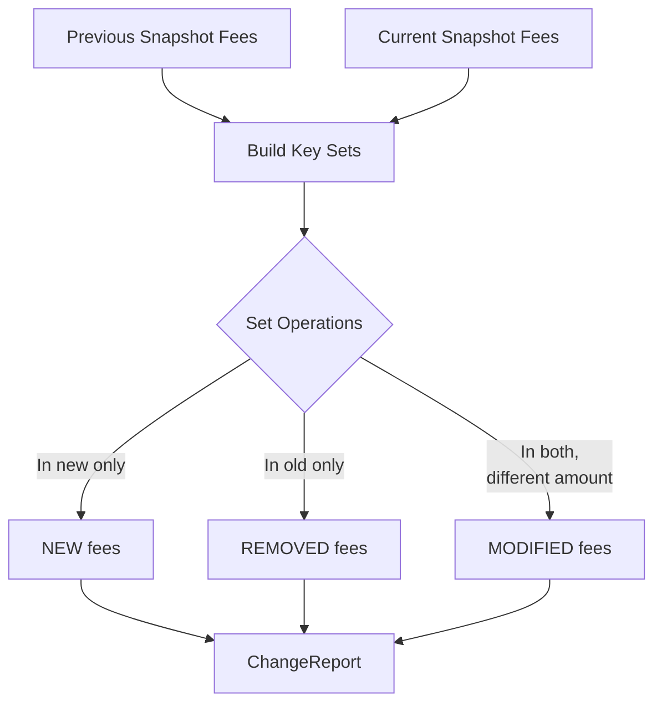

# Pipeline Deep Dive

[← Home](Home.md) | [Architecture Overview](Architecture-Overview.md)

## Pipeline Overview

The core pipeline transforms raw exchange documents into normalized, comparable fee data and detects changes between versions.


## Complete Pipeline Sequence



## Stage 1: Document Collection

**Entry point**: `scraper/document.py: DocumentCollector`

The collector gathers all fee-related documents from an exchange:

1. **Fetch main page** — HTTP (httpx) or Browser (Playwright) based on `scraper_type` in YAML
2. **Discover linked documents** — Scans HTML for PDF/CSV links via BeautifulSoup
3. **Fetch alternate URLs** — Additional URLs from exchange YAML definition, fetched in parallel
4. **Deduplicate** — By `content_hash` (SHA-256)
5. **Select primary** — By format priority



**Format priority**: CSV > PDF > HTML (overridden by exchange's declared `fee_schedule_format`)

**Scraper types**:
- `HTTP` — Fast httpx-based fetching for static pages
- `BROWSER` — Playwright headless browser for JavaScript-rendered pages

## Stage 2: Hash-Based Change Detection

Before parsing, the pipeline compares the `content_hash` of the new primary document against the latest snapshot. If the hash matches, the entire pipeline is skipped — avoiding unnecessary AI costs.

```python
# Simplified logic in pipelines.py
if latest_snapshot and latest_snapshot.content_hash == new_hash:
    log.info("No changes detected, skipping")
    return None  # No pipeline run needed
```

## Stage 3: Parsing and AI Extraction

### Document Parsing

Three parser backends, selected by document format:

| Format | Parser | Method |
|--------|--------|--------|
| PDF | `parser/pdf_parser.py` | PyMuPDF for text, pdfplumber for tables |
| HTML | `parser/html_parser.py` | BeautifulSoup + optional Playwright rendering |
| CSV | `parser/csv_parser.py` | Python csv module with section marker detection |

All parsers return `ExtractedDocument`:
```
ExtractedDocument
├── full_text: str          # Complete document text
├── tables: list[ExtractedTable]  # Structured table data
├── page_count: int
└── metadata: dict
```

### AI Extraction Pipeline

**Entry point**: `parser/ai_extractor.py: AIExtractor`

The AI extraction pipeline processes the parsed document through multiple stages:



**Key behaviors**:
- Documents are split into sections, classified (context vs. fee-bearing), then grouped into chunks of ≤15,000 characters
- Context sections (footnotes, tier definitions) are included as reference material but not extracted from
- Each group gets its own AI call with the exchange-specific prompt
- Budget is checked before each group — extraction stops early if over budget
- Cancellation checkpoints exist before each group (for admin cancel from dashboard)

See [AI Agent System](AI-Agent-System.md) for full agent details.

### Profile-Based Extraction (Zero-Cost Path)

Before calling AI, the pipeline checks if an extraction profile exists and matches the current document structure:



See [Extraction Profiles](Extraction-Profiles.md) for details.

## Stage 4: Normalization

**Entry point**: `normalizer/engine.py: NormalizationEngine`

Maps raw extracted fee dicts to the canonical schema:



**V3 field mappings**:
| Source Field | Target |
|-------------|--------|
| `origin_code` | `ParticipantType` |
| `listing_type` + `penny_class` | `SecurityClass` |
| `auction_type` + `exec_venue` + `product_type` | `OrderType` |
| `liquidity_role` / `exec_venue` | `FeeType` |
| `fee_value` | `amount` (Decimal) |

**Amount storage**: All amounts are stored as `amount_cents` — an integer representing hundredths of a cent (1/10,000th of a dollar). A fee of $0.45/contract is stored as `4500`.

See [Normalization Engine](Normalization-Engine.md) for the full taxonomy.

## Stage 5: Change Detection and Notification

### Change Detection

**Entry point**: `differ/detector.py: ChangeDetector`

Fees are compared using a composite key:

```
fee_key = (participant_type, security_class, order_type, fee_type,
           fee_code, contra_party_type, symbol, tier_number)
```



For the first snapshot of an exchange, all fees are marked as NEW.

### Notification

Three notification frequencies:

| Frequency | Trigger | Template |
|-----------|---------|----------|
| `IMMEDIATE` | After each pipeline run with changes | `fee_change.html` |
| `DAILY_DIGEST` | Celery Beat at 7:00 AM ET | `daily_digest.html` |
| `WEEKLY` | Celery Beat, Monday 8:00 AM ET | `daily_digest.html` |

Email delivery via `aiosmtplib`. Subscribers can filter by specific exchange codes.

## Error Handling and Resilience

- **Redis lock**: Prevents duplicate runs per exchange (30-min TTL)
- **Budget guardrails**: Per-exchange ($2.00) and daily ($15.00) caps prevent runaway AI costs
- **Retry with backoff**: Celery tasks retry on transient failures
- **Graceful degradation**: If AI extraction fails, the pipeline records the failure in `ScrapeLog` but doesn't crash other exchanges
- **Cancellation**: Admin can cancel in-flight runs via dashboard; checked at group boundaries

## Related Pages

- [AI Agent System](AI-Agent-System.md) — agent details, model routing
- [Extraction Profiles](Extraction-Profiles.md) — zero-cost path details
- [Normalization Engine](Normalization-Engine.md) — V2/V3 mapping rules
- [Worker Architecture](Worker-Architecture.md) — task definitions, scheduling
