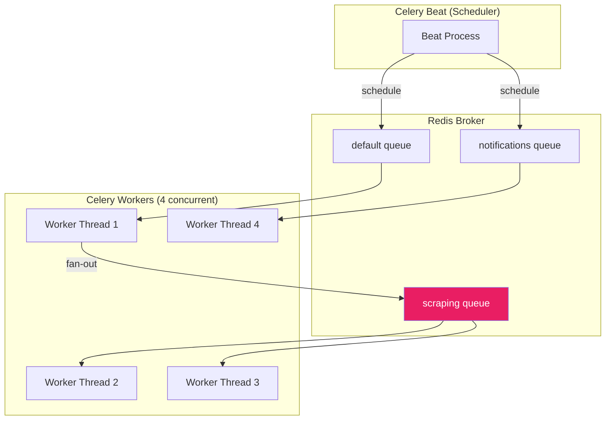
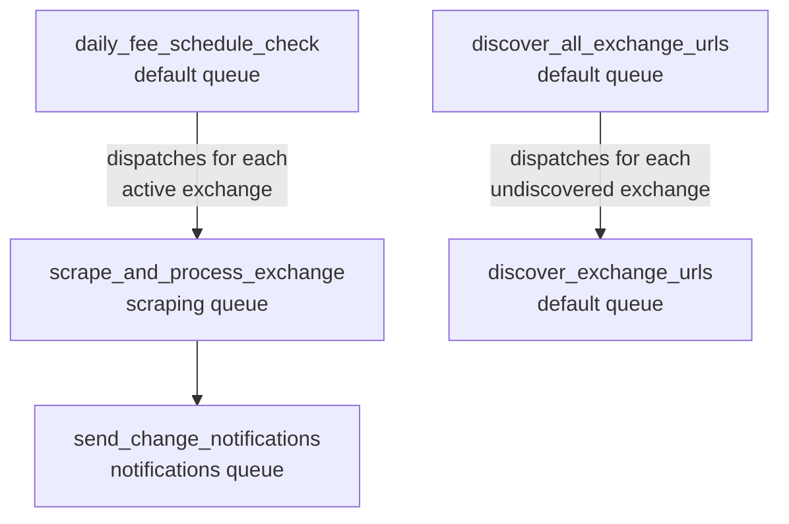
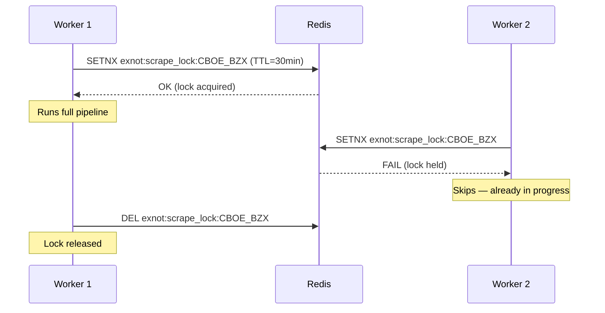
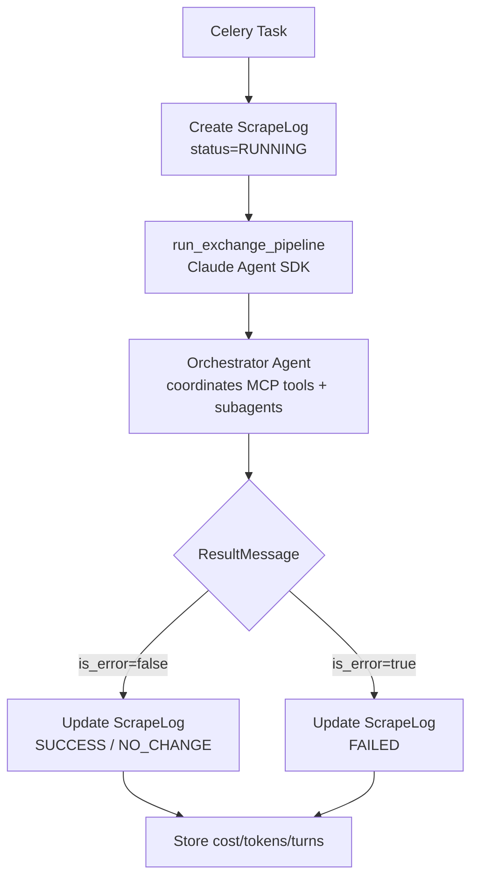

# Worker Architecture

[← Home](Home.md) | [Architecture Overview](Architecture-Overview.md)

## Overview

ExNot uses Celery 5.x with Redis as broker and result backend. Workers handle the heavy lifting — scraping, AI extraction, and email delivery — while the FastAPI web server stays responsive.

## Queue Architecture



### Queue Configuration

| Queue | Purpose | Time Limits |
|-------|---------|-------------|
| `default` | Lightweight coordination tasks | 5 min soft / 10 min hard |
| `scraping` | Per-exchange scrape pipelines | 25 min soft / 30 min hard |
| `notifications` | Email delivery | 2 min soft / 5 min hard |

## Task Definitions

### Core Pipeline Tasks



| Task | Queue | Description |
|------|-------|-------------|
| `daily_fee_schedule_check` | default | Fan-out: dispatches `scrape_and_process_exchange` for each active exchange |
| `scrape_and_process_exchange` | scraping | Full pipeline for one exchange (scrape → parse → normalize → diff → notify). Redis lock prevents duplicate runs. |
| `discover_exchange_urls` | default | URL discovery for one exchange. Rate-limited to 3/min with 2 retries. |
| `discover_all_exchange_urls` | default | Discovers URLs for all undiscovered/failed exchanges |
| `send_change_notifications` | notifications | Immediate email to IMMEDIATE-frequency subscribers |
| `send_daily_digest` | notifications | Daily digest email to DAILY_DIGEST subscribers |
| `send_weekly_summary` | notifications | Weekly digest to WEEKLY subscribers |
| `cleanup_old_scrape_logs` | default | Deletes ScrapeLog records older than 90 days |

### Task Deduplication

The `scrape_and_process_exchange` task uses a Redis distributed lock to prevent race conditions:



Lock key format: `exnot:scrape_lock:{exchange_code}`
TTL: 30 minutes (matches the hard task time limit)
`blocking=False` — tasks skip immediately if the lock is held.

## Beat Schedule

Defined in `workers/schedules.py`:

| Schedule | Cron | Task | Status |
|----------|------|------|--------|
| Daily scrape | `0 6 * * *` | `daily_fee_schedule_check` | **Commented out** (manual trigger only) |
| Daily digest | `0 7 * * *` ET | `send_daily_digest` | Active |
| Weekly summary | `0 8 * * 1` ET | `send_weekly_summary` | Active |
| Log cleanup | `0 2 * * 0` ET | `cleanup_old_scrape_logs` | Active |

> The daily scrape is intentionally disabled — scrapes are triggered manually via the admin API or dashboard during development/testing.

## Celery Configuration

Key settings in `workers/celery_app.py`:

```python
# Concurrency
worker_concurrency = 4

# Serialization
task_serializer = "json"
result_serializer = "json"
accept_content = ["json"]

# Result backend
result_backend = REDIS_URL
result_expires = 3600  # 1 hour

# Task routing
task_routes = {
    "exnot.workers.tasks.scrape_and_process_exchange": {"queue": "scraping"},
    "exnot.workers.tasks.send_*": {"queue": "notifications"},
    "*": {"queue": "default"},
}
```

## Async/Sync Bridge

Celery workers are synchronous. Async operations (scraping, email) are bridged via `asyncio.run()`:

```python
# Simplified pattern in tasks.py
@celery_app.task
def scrape_and_process_exchange(exchange_code: str):
    result = asyncio.run(_async_pipeline(exchange_code))
    return result
```

This gives Celery's reliable task execution (retries, time limits, result tracking) while allowing async I/O for network-heavy operations.

## Pipeline Orchestration

The main pipeline is driven by the Claude Agent SDK orchestrator (`agents/pipeline.py: run_exchange_pipeline`). The Celery task creates a `ScrapeLog` record, then delegates to the SDK:



The orchestrator autonomously decides the execution order based on its system prompt rules — loading exchange config, scraping documents, checking for changes, delegating extraction to subagents, normalizing fees, detecting changes, and sending notifications. All these operations are MCP tools that the orchestrator calls like function calls.

## Monitoring

### Flower

Flower runs at `:5555` providing:
- Real-time task progress
- Worker status
- Task history and results
- Queue depths

### Dashboard Monitor

The admin dashboard at `/dashboard/monitor` provides pipeline monitoring:
- Live event stream via SSE (Redis pub/sub)
- Per-run cost tracking (from Claude Agent SDK `ResultMessage`)
- Expandable log panels for completed runs (from Redis lists)
- Kill button to revoke Celery tasks

See [Dashboard & Monitoring](Dashboard-and-Monitoring.md) for details.

## Running Workers

```bash
# Start worker (all queues)
celery -A exnot.workers.celery_app worker -l info -c 4 \
    -Q default,scraping,notifications

# Start beat scheduler
celery -A exnot.workers.celery_app beat -l info

# Start Flower monitor
celery -A exnot.workers.celery_app flower --port=5555
```

In Docker Compose, these are separate services (`worker`, `beat`, `flower`).

## Related Pages

- [Pipeline Deep Dive](Pipeline-Deep-Dive.md) — what happens inside each task
- [AI Agent System](AI-Agent-System.md) — AI extraction within workers
- [Configuration Guide](Configuration-Guide.md) — Redis, concurrency settings
- [Dashboard & Monitoring](Dashboard-and-Monitoring.md) — monitoring UI
